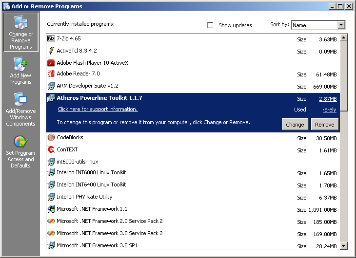
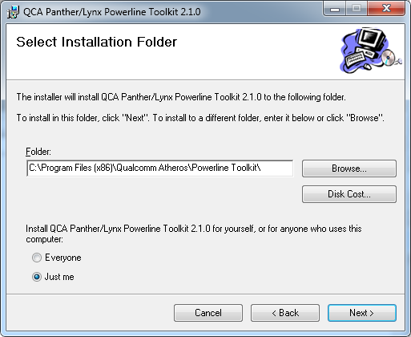
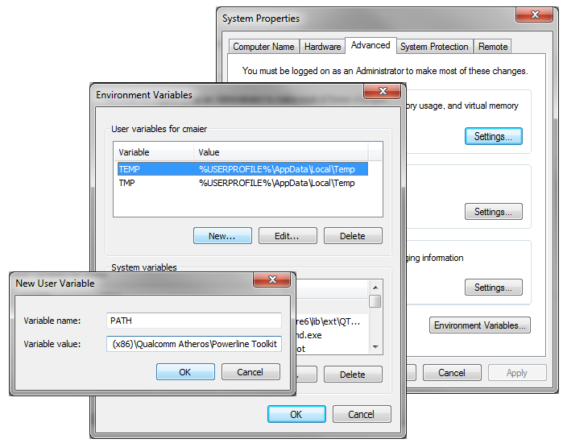

.. _overview:

Overview
########

.. _overview-intro:

Introduction
============

The :program:`Open Powerline Toolkit` (vanilla version) may be downloaded from `https://github.com/qca/open-plc-utils.git <None>`_ by any interested party. An advanced version (chocolate version) may be downloaded from the Qualcomm Atheros Customer FTP site by parties having permission to do so. The chocolate version includes special programs that perform advanced engineering, production and maintenance tasks. Within this document, we refer to both versions, collectively, as "the toolkit".

The toolkit contains C Language source code and *GNU* makefiles to compile many useful programs. It also includes Linux shell scripts that use these programs, in various ways, to interrogate, control and manage Qualcomm Atheros *INT6000*, *INT6300*, *INT6400*, *AR7400* and later powerline devices. Qualcomm Atheros also provides a similar, but less extensive, toolkit for *INT5500* powerline devices.

The toolkit is intended for hardware engineers, verification engineers, field engineers and embedded software developers, consequently, programs are simple and compact. It is not intended for computer novices or retail users. Many customers embed a subset of toolkit programs in products for troubleshooting purposes.

The toolkit includes extensive HTML documentation and online man pages for users who cannot access installed man pages. HTML documentation starts with file `docbook/index.html <index.html>`_. Online man pages start with file `docbook/toolkit.html <toolkit.html>`_. Qualcomm Atheros recommends that you add these two pages to your browser favorites for later reference.

All toolkit programs are written in C and have command line intefaces. The source code essentially conforms to `ISO/IEC9899:1999 <http://www.open-std.org/jtc1/sc22/wg14/www/standards.html#9899>`_. The source tree cleanly compiles using gcc or pcc on Ubuntu, OpenBSD and MacOSX. It also compiles under Microsoft C with the inclusion of special header files. The command line interface conforms to `*Section 12.2 Utility Syntax Guidelines* <http://www.opengroup.org/onlinepubs/009695399/basedefs/xbd_chap12.html#tag_12_02>`_ of The Open Group Base Specification Issue 6 (`*IEEE Std 1003.1, 2004 Edition* <http://www.opengroup.org/onlinepubs/009695399/mindex.html>`_).

The toolkit includes Microsoft Visual Studio .NET project files and solutions files to compile toolkit programs, plus the executable version (:file:`.exe`) of each program and a set of Microsoft installation file (:file:`.msi`) so that the toolkit package comes ready to install and run on any Windows host; however, Qualcomm Atheros does not provide support for Microsoft windows version of this toolkit. Toolkit documentation does provide Windows developers with special guidance on setting up their own Visual Studio projects and solutions, should they want to do that.

.. _overview-background:

Background
==========

HomePlug AV is an industry standard protocol for powerline communications developed by the `HomePlug Powerline Alliance <http://www.homeplug.org/home>`_. Qualcomm Atheros manufactures a family of chipsets that conform to that standard and have MII, UART and SPI host interfaces. The *INT6x00* and *AR7x00* series are flagship members of that chipset family. The principle difference between the chipsets is their boot method, cost and speed. The INT6000 requires onboard NVRAM but the *INT6300*, *INT6400* and *AR7400* do not.

The HomePlug AV protocol is based on IEEE-802.3, has ethertype ``0x88E1`` and uses special message formats. A subset of those message formats is reserved for each chipset vendor to define their own message formats. Qualcomm Atheros uses this vendor-specific subset to communicate between host processors and Qualcomm Atheros devices. This toolkit uses Qualcomm Atheros vendor-specific message formats to communicates with Qualcomm Atheros devices. It also understands Qualcomm Atheros firmware and configuration file formats.

This toolkit sends and receives Qualcomm Atheros vendor-specific messages but not generic HomePlug AV messages. Qualcomm Atheros vendor-specific management message formats are described in the Qualcomm Atheros *HomePlug AV Firmware Technical Reference Manual*. If you do not have a copy of this document then you may request one from Qualcomm Atheros.

.. _overview-distribution:

Toolkit Distribution
====================

The Qualcomm Atheros :program:`Open Powerline Toolkit` is distributed using compressed tape archive files named :file:`open-plc-utils-x.x.x.tar.gz` and :file:`open-plc-utils-x.x.x.tar.bz2` and standard compressed archive file named :file:`open-plc-utils-x.x.x.zip`, where *x.x.x* is the version number. Archive files ending in :file:`.gz` can be decompressed with the Linux :program:`gzip` utility. Archive files ending in :file:`.bz2` can be decompressed with the Linux :program:`bzip2` utility. Archive files ending in :file:`.zip` can be decompressed using the Linux :program:`unzip` utility or the Windows :program:`WinZip` utility. The contents of decompressed archives can be extracted using the Linux :program:`tar` utility. Recent versions of the Linux :program:`tar` utility allow decompression and extraction in one operation. The :program:`WinZip` or :program:`7-zip` program may be used to decompress archives and extract contents on Microsoft Windows platforms.

Some Windows network administrators enable security software that removes :file:`.exe` and other executable files from :file:`.zip` archives in transit or in-situ. In that case, Windows user may want to download the :file:`*.tar.gz` archive and use a program like :program:`7zip` to unpack the archive file.

The toolkit includes source code, build scripts, documentation and pre-compiled programs for Microsoft Windows. Some third party libraries may also be included to support Microsoft platforms. Although the Microsoft Windows versions of toolkit programs are pre-compiled and ready-to-run, they are not supported because this package is designed for use on Linux platforms.

The Windows installer included in this version of the toolkit needs Microsoft .NET 1.1. Windows versions of toolkit programs that communicate with powerline devices need WinPcap 4.1.2 or later. A copy of Microsoft .NET 1.1 and WinPcap 4.1.2 is included in the :file:`support` folder.

.. _install-linux:

Toolkit Installation on Linux
=============================

The Linux version of the toolkit must be compiled from source code. The only requirement is the standard :program:`GNU/Linux` toolchain consisting of :program:`make`, :program:`gcc` and :program:`ld`. These are included with most :program:`Linux` distributions but may require installation. On *Debian* based distributions, such as *Ubuntu*, they may be installed using :program:`apt-get`. On *RedHat* distributions, such as *Fedora*, they may be installed using :program:`rpm`. On *SuSE* based distributions, they may be installed using :program:`YaST2`.

Toolkit Installation on GNU/*Linux*
-----------------------------------

Toolkit Installation on GNU/*Linux*
~~~~~~~~~~~~~~~~~~~~~~~~~~~~~~~~~~~
.. code-block:: console

    $ cp plc-utils-1.2.1.tar.gz /home/mydir
    $ cd /home/mydir
    $ tar -vzxf plc-utils-1.2.1.tar.gz
    $ cd plc-utils-1.2.1
    $ make
    $ sudo make install
    $ make manuals

Decompress the archive and extract the contents with the :program:`tar` utility. This will create a folder having the same basename as the archive such that one version will not over-write another. Consult the :program:`tar` man page on your system for detailed instructions. Change directory to the appropriate folder.

The main package folder contains a recursive :file:`Makefile` that will compile and install all toolkit programs. If you do not want to compile and install all programs then change directory to the appropriate folder and run :program:`make` from there. To compile binary files, type ``make``. To install binary files, type ``make install``. To install man pages, type ``make manuals``. The package does not automatically install examples, scripts, applets or man pages.

We recommend that you :command:`login` as ``root`` user before installing the toolkit; otherwise, you will be prompted for the ``root`` password as each program or component is installed.

Programs are installed in folder :file:`/usr/local/bin` and man pages are installed in folders :file:`/usr/share/man/man1`. If these folders are not correct for your system, or if you want to install in other folders, then edit the folder names defined in the :ref:`make.def <software-cross-compile>` file found in main toolkit folder or over-ride these definitions in subordinate makefiles.

Toolkit Documentation on GNU/Linux
----------------------------------

Toolkit web pages are not automatically installed. To access toolkit documentation, point your browser to `docbook/index.html <index.html>`_ and add the page to the browser bookmark or favorites list. If you are interested in how the toolkit has been implemented then do the same for page `docbook/toolkit.html <toolkit.html>`_.

The method described above is only recommended if you do not plan to move or remove toolkit folders. Otherwise, you can merely copy the entire contents of the toolkit :file:`docbook` folder to another folder of your choice and point your browser to the new file locations.

.. code-block:: console

    $ cp -rv docbook/* /home/mydir/toolkit

Toolkit Removal on GNU/*Linux*
------------------------------

To uninstall installed programs and man pages on Linux, change to the main toolkit folder and type ``make uninstall``.

Toolkit Removal on GNU/*Linux*
~~~~~~~~~~~~~~~~~~~~~~~~~~~~~~
.. code-block:: console

    $ cd /home/mydir/plc-utils-1.2.1
    $ sudo make uninstall

.. _install-macosx:

Toolkit Installation on Mac OS X
================================

Toolkit installation on *Mac OS X* is essentially identical to installation on Linux but special steps are needed before starting.

First, you must install the toolkit as the ``root`` user or you will be denied permission. The ``root`` user account is disabled by default and so you must enable it in order to login. Follow instructions at `Enabling the "root" user in Mac OS X <http://support.apple.com/kb/HT1528>`_ to enable the account and login. After installation, toolkit programs should be run from a normal user account.

Second, *Mac OS X* does not include C Language development tools by default. You must download and install them in order to build the toolkit. You can download and install them from the Apple website or (if you are ambitious) download, compile and install them from various open source websites. Consider using `Xcode <https://developer.apple.com/technologies/tools/>`_ on :program:`Mac OS X Leopard` or :program:`Lion`.

Login as the root user and download or copy the toolkit archive file to your preferred folder then follow the :ref:`instructions <install-linux>` for installing the toolkit on Linux.

Setting the ``PATH`` variable on *OS X*
---------------------------------------

While still logged in as the ``root`` user, edit :file:`/etc/profile` and add folder :file:`/usr/local/bin` to the ``PATH`` definition found there. This will ensure that all users can access toolkit programs. The change may not take effect until the next time you login or open a new command shell.

.. code-block:: bash

    PATH="/bin:/sbin:/usr/local/bin"

Installing the Toolkit on *Mac OS X*
------------------------------------

While still logged in as the ``root`` user, remember to delete the toolkit source folder or, at least change ownership of all files in the toolkit folder, so that you can access and/or remove them later.

.. code-block:: console

    $ cd ..
    $ rm -r plc-utils-x.x.x

.. _install-windows-xp:

Toolkit Installation on *Windows XP*
====================================

The *Windows* version of the toolkit comes pre-compiled and ready to install and run using the :program:`Windows Installer`. You may copy and distribute installation file :file:`plc-utils-x.x.x.msi`. Users may then click on the installation file to install the package then discard it afterwards. The installation file permits remote installation over the network.

The version of the Windows Installer used here needs Microsoft *.NET Framework 1.1* to work correctly. Newer versions of the *.NET Framework* will not work. The *.NET Framework* must be installed before the toolkit is installed or the *Windows Installer* will report dependency errors and refuse to complete installation. Multiple versions of the *.NET Framework* can coexist under *Windows 7*. The *.NET Framework* needed is included in the toolkit :file:`support` folder.

Windows versions of toolkit programs that communicate with powerline devices all need *WinPcap* from `winpcap.org <http://www.winpcap.org/install/default.htm>`_ to read and write Ethernet frames. *WinPcap* may be installed before or after toolkit installation but tools that access powerline devices will not run without it. You may want to install *WinPcap* before starting toolkit installation. If you have *Wireshark* installed then you probably already have *WinPcap* installed. A recent copy of *WinPcap* is included in the toolkit :file:`support` folder.

Failure to :ref:`remove previous toolkit versions <removal-windows-xp>` on some systems may result in the message "Another version of this product is already installed" when trying to install a new version. You may want to remove prior version before starting toolkit installation.

Obtaining the Toolkit
---------------------

QCA customers can download the toolkit from the QCA Customer FTP Site.

QCA employees may be able to download the toolkit from the QCA Application Engineering World FTP site ftp://appslinux01.qca.qualcomm.com/toolkit/plc-utils/. There are several installers available for Windows. Each installs a subset of the toolkit. Download the desired installer files to your local machine then execute them by right-clicking on them and selecting option "Run as Administrator".

Installing the Toolkit
----------------------

Use a compression program like :program:`WinZip` to decompress the archive file and extract all files. Use Microsoft :program:`Windows Explorer` to locate file :file:`.\\VisualStudioNET\\plc-utils-x.x.x.msi` under the main toolkit folder. Click on the file to start the :program:`Windows Installer` then follow the installation instructions.

Windows Installer Dialogue
~~~~~~~~~~~~~~~~~~~~~~~~~~

.. image:: images/WinXP-WindowsInstaller.png

Older toolkit programs were installed in folder :file:`C:\\Program Files\\Atheros\\Toolkit` but they are now installed in folder :file:`C:\\Program Files\\Qualcomm Atheros\\Open Powerline Toolkit` instead. If you select a different folder, remember it for the next step.

Setting the PATH variable
-------------------------

:program:`Toolkit` programs have command line interfaces and must be run from an open console window. To simplify program access and minimize the typing required, add the toolkit installation path mentioned above to the :envvar:`PATH` environment variable by following steps listed below. If you have ``Administrator`` privileges then we recommend that you edit the system :envvar:`PATH` variable; otherwise, you may need to create and/or edit a user :envvar:`PATH` variable.

Control Panel System Dialogue
~~~~~~~~~~~~~~~~~~~~~~~~~~~~~

#. On the :command:`Start` menu, select the :command:`Control Panel` option.

#. In the :command:`Control Panel` window, select the :command:`System` icon.

#. On the :command:`System Properties` dialog box, select the :command:`Advanced` tab.

#. On the :command:`Advanced` tab, press the :command:`Environment Variables` button.

#. On the :command:`Environment Variables` dialog box, scroll down the :command:`System variables` list and select the :command:`Path` variable then press the :command:`Edit` button.

#. On the :command:`Edit System Variable` dialogue box, append the installation path to the :command:`Variable value` field.

#. Press the :command:`OK` button.

.. _removal-windows-xp:

Removing the Toolkit
--------------------

To remove an existing version of the Qualcomm Atheros :program:`Open Powerline Toolkit` from your system, follow the steps listed below. If the toolkit is not installed on your system then omit these steps. If you are unsure, you can follow them to determine if you have the toolkit installed or you can attempt to install, anyway, and return here if installation is prevented.

Control Panel Add/Remove Dialogue
~~~~~~~~~~~~~~~~~~~~~~~~~~~~~~~~~

#. On the :command:`Start` menu, select the ``Control Panel`` option.

#. In the :command:`Control Panel` window, select the ``Add or Remove Programs`` icon.

#. On the :command:`Add or Remove Programs` dialog box, scroll down and select the Qualcomm Atheros ``Open Powerline Toolkit`` entry then press the ``Remove`` pushbutton.

.. _install-windows-7:

Toolkit Installation on *Windows 7*
===================================

The *Windows* version of the toolkit comes pre-compiled and ready to install and run using the native :program:`Windows Installer`. You may copy and distribute installation file :file:`plc-utils-x.x.x.msi`. Users merely click on the file to install the package and may discard it afterwards. This method of installation permits remote installation over network.

The version of the Windows Installer used here needs Microsoft *.NET Framework 1.1* to work correctly. Newer versions of the *.NET Framework* will not work. The *.NET Framework* must be installed before the toolkit is installed or the *Windows Installer* will report dependency errors and refuse to complete installation. Multiple versions of the *.NET Framework* can coexist under *Windows 7*. The *.NET Framework* needed is included in the toolkit :file:`support` folder.

Failure to :ref:`remove previous toolkit versions <removal-windows-7>` on some systems may result in the message "Another version of this product is already installed" when trying to install a new version. You may want to remove prior version before starting toolkit installation.

Windows versions of toolkit programs that communicate with powerline devices all need *WinPcap* from `winpcap.org <http://www.winpcap.org/install/default.htm>`_ to read and write Ethernet frames. *WinPcap* may be installed before or after toolkit installation but tools that access powerline devices will not run without it. You may want to install *WinPcap* before starting toolkit installation. If you have *Wireshark* installed then you probably already have *WinPcap* installed. A recent copy of *WinPcap* is included in the toolkit :file:`support` folder.

Obtaining the Toolkit
---------------------

QCA customers can download the toolkit from the QCA Customer FTP Site.

QCA employees may be able to download the toolkit from the QCA Application Engineering World FTP site ftp://appslinux01.qca.qualcomm.com/toolkit/plc-utils/. There are several installers available for Windows. Each installs a subset of the toolkit. Download the desired installer files to your local machine then execute them by right-clicking on them and selecting option "Run as Administrator".

Installing the Toolkit
----------------------

Older toolkit programs were installed in folder :file:`C:\\Program Files\\Atheros\\Toolkit` by default but now they are installed in :file:`C:\\Program Files (x86)\\Qualcomm Atheros\\Open Powerline Toolkit` instead. If you select a different folder during installation then remember it for the next step.

Windows Installer Dialogue
~~~~~~~~~~~~~~~~~~~~~~~~~~

Accept install defaults.

Setting the PATH variable
-------------------------

:program:`Toolkit` programs have command line interfaces and must be run from an open console window. To simplify program access and minimize the typing required, add the toolkit installation path mentioned above to the :envvar:`PATH` environment variable by following steps listed below. If you have ``Administrator`` privileges then we recommend that you edit the system :envvar:`PATH` variable; otherwise, you may need to create and/or edit a user :envvar:`PATH` variable.

Control Panel System Dialogue
~~~~~~~~~~~~~~~~~~~~~~~~~~~~~

#. On the :command:`Start` menu, select the :command:`Control Panel` option.

#. On the :command:`Adjust system settings` page, select the :command:`System` icon.

#. On the :command:`View basic information about your computer` page, select the :command:`Advanced system settings` option.

#. On the :command:`System Properties` dialog, press the :command:`Environment Variables` button.

#. On the :command:`Environment Variables` dialog box, scroll down the :command:`System variables` list and select the :command:`Path` variable then press the :command:`Edit` button.

#. On the :command:`Edit System Variable` dialogue box, append the installation path to the :command:`Variable value` field.

#. Press the :command:`OK` button.

Environment variable changes made here do not take effect until a console window is opened. This means that you may need to close and then reopen console windows that depend on the changes. It is a good idea to immediately open a console window and execute a toolkit command in order to confirm that the ``PATH`` variable is properly defined.

.. _removal-windows-7:

Removing the Toolkit
--------------------

To remove an existing version of the Qualcomm Atheros :program:`Open Powerline Toolkit` from your system, follow the steps listed below. If the toolkit is not installed on your system then omit these steps. If you are unsure, you can follow them to determine if you have the toolkit installed or you can attempt to install, anyway, and return here if installation is prevented.

Control Panel Add/Remove Dialogue
~~~~~~~~~~~~~~~~~~~~~~~~~~~~~~~~~

.. image:: images/Win7-remove-program.png

#. On the :command:`Start` menu, select the ``Control Panel`` option.

#. On the :command:`Adjust system settings` page, select the :command:`Programs and Features` icon.

#. On the :command:`Uninstall or change a program` page, scroll down and select the appropriate QCA ``Open Powerline Toolkit`` entry then press the ``Remove`` pushbutton. There may be several different QCA Open Powerline Toolkit entries so be sure to select the correct one.

.. _overview-programs:

Toolkit Programs
================

The Qualcomm Atheros :program:`Open Powerline Toolkit` is a collection of small, command line programs. Each program deals with some aspect of powerline device management. Programs can be combined, in various ways, using shell scripts, to perform sophisticated and complex tasks. With these program, one can identify chipset and firmware version, reset devices, flash devices, identify other powerline network devices, validate :file:`*.pib` and :file:`*.nvm` files, sniff HomePlug AV Ethernet frames, send generic Ethernet frames and so on.

Program source code is designed to demonstrate device hardware and firmware features and to illustrate techniques for software developers and hardware engineers. The source code may be modified and distributed without obligation to Qualcomm Atheros; however Qualcomm Atheros would appreciate feedback concerning improvements to program useability, reliability or efficiency. Keep in mind that these tools, unlike some other tools, are intended to be simple and compact.

Most programs in this toolkit start their life on Linux and are eventually ported to other environments. Consequently, not all programs are available in the Windows version of the toolkit but most of them are.

Program descriptions appear below in alphabetical order. Alternately, you may browse the latest program descriptions and source code `here <toolkit.html>`_.

.. _programs-6400-Management:

INT6400 Device Management
-------------------------

Programs in this group are older versions that communicate with INT6x00 chipsets. Many still work on AR7x00 chipsets. The main difference is due to the higher PHY data rates on AR7x00 chipsets. The higher data rates must be expressed using 16-bits instead of 8-bits. Consequently, some MME formats have changed.

.. _program-int64host:

:program:`int64host`
    A command line utility that waits for and services VS_HST_ACTION messages from a flash-less device *INT6300* or *INT6400* device. It is similar to program :ref:`int6khost <program-int6khost>` but does not use an SDRAM configuration files. This program is installed in folder :file:`/usr/local/bin` with 4555 file permissions. See the discussion on security for more information about file permissions. The main source code is located in folder :file:`./plc`. See the `int64host <int64host.7.html>`_ man page for more information.

:program:`int6k`
    A command line utility to inspect and control INT6000 and INT6300 devices connected to the local host. It performs several of the device maintenance functions available in the  Atheros  :program:`Windows Device Manager` but is small enough to run on an embedded system. This program is installed in folder :file:`/usr/local/bin` with 4555 file permissions. See the discussion on security for more information about file permissions. The main source code is located in folder :file:`.int6k`. See the `int6k <int6k.7.html>`_ man page for more information.

.. _program-int6k2:

:program:`int6k2`
    A command line utility to inspect and control INT6000 and *int6300* devices connected to the local host. It is similar to :program:`int6k` but calls the  Atheros  :program:`Embedded API`, described in the  Atheros  *HomePlug AV API User's Guide*, to perform device management tasks. This program is installed in folder :file:`/usr/local/bin` with 4555 file permissions. See the discussion on security for more information about file permissions. The main source code is located in folder :file:`./plc`. See the `int6k2 <int6k2.7.html>`_ man page for more information.

:program:`int6kboot`
    A command line utility to start and optionally flash INT6300 and INT6400' devices that have no NVRAM or have a blank or corrupted NVRAM. It communicates with the Atheros  :program:`Bootloader` to configure SDRAM, download runtime firmware and PIB and start firmware execution. Users can optionally request that the same PIB and firmware then be used to flash NVRAM. It is similar to program `int6kf <int6kf.7.html>`_ but does not accept an SDRAM configuration file. Instead,  it uses on the `memctl <memctl.7a.html>`_ applet. This program is installed in folder :file:`/usr/local/bin` with 4555 file permissions. See the discussion on security for more information about file permissions. The main source code is located in folder :file:`./plc`. See the `int6kboot <int6kboot.7.html>`_ man page for more information.

:program:`int6kf`
    A command line utility to start and optionally flash INT6000 and INT6300 devices having no NVRAM or having a blank or corrupted NVRAM. It communicates with the Atheros  :program:`Bootloader` to configure SDRAM, download runtime firmware and PIB and start firmwrae execution. It can also be used to force flash blank or corrupted NVRAM. It is similar to program `int6kboot <int6kboot.7.html>`_ but requires an SDRAM parameter file. This program is installed in folder :file:`/usr/local/bin` with 4555 file permissions. See the discussion on security for more information about file permissions. The main source code is located in folder :file:`./plc`. See the `int6kf <int6kf.7.html>`_ man page for more information.

.. _program-int6khost:

:program:`int6khost`
    A command line utility that waits for and services VS_HST_ACTION messages from a flash-less *INT6000* or *INT6300* device. It is similar to program :ref:`in64host <program-int64host>` but needs an SDRAM configuration file. This program is installed in folder :file:`/usr/local/bin` with 4555 file permissions. See the discussion on security for more information about file permissions. The main source code is located in folder :file:`./plc`. See the `int6khost <int6khost.7.html>`_ man page for more information.

:program:`int6kid`
    A command line utility that prints the DAK or NMK strings read from one or more devices. It can be used in shell scripts to dynamically obtain device keys and insert them on program command lines as arguments. This program is installed in folder :file:`/usr/local/bin` with 4555 file permissions. See the discussion on security for more information about file permissions. The main source code is located in folder :file:`./plc`. See the `int6kid <int6kid.7.html>`_ man page for more information.

:program:`int6klist`
    A command line utility that lists local devices, or remote devices associated with a specific device, on stdout in undecorated format. It can be used in shell scripts to dynamically determine, and then traverse, network topology. This program is installed in folder :file:`/usr/local/bin` with 4555 file permissions. See the discussion on security for more information about file permissions. The main source code is located in folder :file:`./plc`. See the `int6klist <int6klist.7.html>`_ man page for more information.

:program:`int6kprobe`
    A command line utility that probes for neighboring networks. This program is installed in folder :file:`/usr/local/bin` with 4555 file permissions. See the discussion on security for more information about file permissions. The main source code is located in folder :file:`./plc`. See the `int6kprobe <int6kprobe.7.html>`_ man page for more information.

:program:`int6krule`
    A command line utility to format and send classification rules to a device. Classification rules are specified using symbolic names for actions, options, conditions and frame fields. This program is installed in folder :file:`/usr/local/bin` with 4555 file permissions. See the discussion on security for more information about file permissions. The main source code is located in folder :file:`./plc`. See the `int6krule <int6krule.7.html>`_ man page for more information.

.. _program-int6ktest:

:program:`int6ktest`
    A command line utility that downloads and executes program images stored in an Atheros :file:`.nvm` file. This program can be used to download and execute Atheros hardware diagnostic programs like those in the :file:`./applets` folder. It is not intended to download and start runtime firmware, although it may be used for that. The program is installed in folder :file:`/usr/local/bin` with 4555 file permissions. See the discussion on security for more information about file permissions. The main source code is located in folder :file:`./plc`. See the `int6ktest <int6ktest.7.html>`_ man page for more information.

:program:`int6kuart`
    A command line utility used to manage a local powerline device over a host serial line interface. Program command line options are translated to AT-style serial commands and sent to the device. THe primary benefits of using this program, in place of a terminal emulator, is the ability to download parameter blocks and upload paameter blocks and firmware images. The program is installed in folder :file:`/usr/local/bin` with 4555 file permissions. See the discussion on security for more information about file permissions. The main source code is located in folder :file:`./serial`. See the `int6kuart <int6kuart.7.html>`_ man page for more information.

:program:`int6kwait`
    A command line utility that polls the local powerline device and waits for the bootloader or runtime firmware to either stop executing or start executing or wait for a device to associate with another device. It can be used to synchronize scripts with device or network events such as connection make or break, power on or off and firmware stop or start. This program is installed in folder :file:`/usr/local/bin` with 4555 file permissions. See the discussion on security for more information about file permissions. The main source code is located in folder :file:`./plc`. See the `int6kwait <int6kwait.7.html>`_ man page for more information.

.. _programs-6400-Monitoring:

INT6400 Device Monitoring
-------------------------

:program:`int6klog`
    A command line utility that exports the runtime watchdog report in binary or XML format. Output is suitable for input to the Atheros Windows Device Manager. This program is installed in folder :file:`/usr/local/bin` with 4555 file permissions. See the discussion on security for more information about file permissions. The main source code is located in folder :file:`./plc`. See the `int6klog <int6klog.7.html>`_ man page for more information.

.. _program-int6krate:

:program:`int6krate`
    A command line utility that polls a device and prints the average transmit and receive PHY rates between it and each of it's network neighbors. Program output is suitable for loading into a spreadsheet or other program that can process column-oriented information. This program is installed in folder :file:`/usr/local/bin` with 4555 file permissions. See the discussion on security for more information about file permissions. The main source code is located in folder :file:`./plc`. See the `int6krate <int6krate.7.html>`_ man page for more information.
    This program is suitable for use with INT6x00 chipsets but not AR7x00 chipsets due to higher PHY rates. Use program :ref:`amprate <program-amprate>` for AR7x00 chipsets and :ref:`plcrate <program-plcrate>` for mixed chipset environments.

:program:`int6kstat`
    A command line utility that polls a poserline device and prints various network and link statistics in a format suitable for processing by another program. It is a work in progress because we are investigating different ways to present the information. This program is installed in folder :file:`/usr/local/bin` with 4555 file permissions. See the discussion on security for more information about file permissions. The main source code is located in folder :file:`./plc`. See the `int6kstat <int6kstat.7.html>`_ man page for more information.

.. _programs-7400-Management:

AR7400 Device Management
------------------------

The programs in this group are essentially identical to those in the INT6x00 group but they support higher PHY data rates offered by the AR7x00 chipsets. Specifically, they handle the new  ``VS_NW_INFO`` and ``VS_LNK_STATS`` message formats.

:program:`ampboot`
    This program is installed in folder :file:`/usr/local/bin` with 4555 file permissions. See the discussion on security for more information about file permissions. The main source code is located in folder :file:`./plc`. See the `ampboot <ampboot.7.html>`_ man page for more information.

.. _program-amphost:

:program:`amphost`
    This program is installed in folder :file:`/usr/local/bin` with 4555 file permissions. See the discussion on security for more information about file permissions. The main source code is located in folder :file:`./plc`. See the `amphost <amphost.7.html>`_ man page for more information.

:program:`ampinit`
    This program is installed in folder :file:`/usr/local/bin` with 4555 file permissions. See the discussion on security for more information about file permissions. The main source code is located in folder :file:`./plc`. See the `ampinit <ampinit.7.html>`_ man page for more information.

:program:`amplist`
    This program is installed in folder :file:`/usr/local/bin` with 4555 file permissions. See the discussion on security for more information about file permissions. The main source code is located in folder :file:`./plc`. See the `amplist <amplist.7.html>`_ man page for more information.

:program:`amptest`
    A command line utility that downloads and executes program images stored in an Atheros :file:`.nvm` file. It can be used to download and execute special Atheros hardware diagnostic programs. It is not intended to download and start runtime firmware. The program is installed in folder :file:`/usr/local/bin` with 4555 file permissions. See the discussion on security for more information about file permissions. The main source code is located in folder :file:`./plc`. See the `amptest <amptest.7.html>`_ man page for more information.

:program:`amptool`
    This program is installed in folder :file:`/usr/local/bin` with 4555 file permissions. See the discussion on security for more information about file permissions. The main source code is located in folder :file:`./plc`. See the `amptool <amptool.7.html>`_ man page for more information.

:program:`ampwait`
    This program is installed in folder :file:`/usr/local/bin` with 4555 file permissions. See the discussion on security for more information about file permissions. The main source code is located in folder :file:`./plc`. See the `ampwait <ampwait.7.html>`_ man page for more information.

.. _programs-7400-Monitoring:

AR7400 Device Monitoring
------------------------

The programs in this group are essentially identical to those in the INT6x00 group but they support higher PHY data rates offered by the AR7x00 chipsets. Specifically, they handle the new  ``VS_NW_INFO`` and ``VS_LNK_STATS`` message formats.

.. _program-amprate:

:program:`amprate`
    A command line utility that polls a device and prints the average transmit and receive PHY rates between it and each of it's network neighbors. Program output is suitable for loading into a spreadsheet or other program that can process column-oriented information. This program is installed in folder :file:`/usr/local/bin` with 4555 file permissions. See the discussion on security for more information about file permissions. The main source code is located in folder :file:`./plc`. See the `amprate <amprate.7.html>`_ man page for more information.
    This program is suitable for use with AR7x00 chipsets and later that have higher PHY rates and newer firmware. Use program :ref:`int6krate <program-int6krate>` for AR6x00 running earlier runtime firmware that may not recognize newer message formats. Use program :ref:`plcrate <program-plcrate>` for mixed chipset environments

.. _program-ampsnif:

:program:`ampsnif`
    Enables or disables the powerline sniffer mode on the local powerline device using the VS_SNIFFER message. Use program :ref:`ampsnot <program-ampsnot>` to display and/or record sniffer output. This program is installed in folder :file:`/usr/local/bin` with 4555 file permissions. See the discussion on security for more information about file permissions. The main source code is located in folder :file:`./plc`. See the `ampsnif <ampsnif.7.html>`_ man page for more information.

.. _program-ampsnot:

:program:`ampsnot`
    Listens for sniffer output from the local powerline device and display results on the console. Use program :ref:`ampsnif <program-ampsnif>` to enable or disable sniffer output. This program is installed in folder :file:`/usr/local/bin` with 4555 file permissions. See the discussion on security for more information about file permissions. The main source code is located in folder :file:`./plc`. See the `ampsnot <ampsnot.7.html>`_ man page for more information.

:program:`ampstat`
    This program is installed in folder :file:`/usr/local/bin` with 4555 file permissions. See the discussion on security for more information about file permissions. The main source code is located in folder :file:`./plc`. See the `ampstat <ampstat.7.html>`_ man page for more information.

:program:`amptone`
    This program is installed in folder :file:`/usr/local/bin` with 4555 file permissions. See the discussion on security for more information about file permissions. The main source code is located in folder :file:`./plc`. See the `amptone <amptone.7.html>`_ man page for more information.

:program:`mdustats`
    A command line utility to collect and display various MDU traffic statistics. This program is installed in folder :file:`/usr/local/bin` with 0555 file permissions. The main source code is located in folder :file:`./plc`. See the `mdustats <mdustats.7.html>`_ man page for more information.

.. _programs-7420:

AR7420 Device Configuration
---------------------------

Programs in this group understand changes to .nvm file formats and to the device boot and memory flash messages and sequences.

.. _program-plchost:

:program:`plchost`
    This program is installed in folder :file:`/usr/local/bin` with 4555 file permissions. See the discussion on security for more information about file permissions. The main source code is located in folder :file:`./plc`. See the `plchost <plchost.7.html>`_ man page for more information.

:program:`plctest`
    A command line utility that downloads and executes small program images stored in older and newer :file:`.nvm` files. It can be used to download and execute small powerline diagnostic programs. It is not intended to download and start runtime firmware. The program is installed in folder :file:`/usr/local/bin` with 4555 file permissions. See the discussion on security for more information about file permissions. The main source code is located in folder :file:`./plc`. See the `plctest <plctest.7.html>`_ man page for more information.
    This program automatically detects the type of .nvm file format and adapts.

.. _programs-configure:

Parameter File Management
-------------------------

Programs in this group are used to inspect and change .pib files in various ways. The do not communicate directly with the powerline device. Use program int6k, amptool or plctool to read the PIB from a powerline device or write a PIB to the powerline device.

.. _program-chkpib:

:program:`chkpib`
    A command line utility to validate :file:`.pib` files based on their internal checksum, file size and other characteristics. It can also be used to produce a text catalog of :file:`.pib` files. This program is slower than program :ref:`chkpib2 <program-chkpib2>` but requires less memory to execute. This program is installed in folder :file:`/usr/local/bin` with 0555 file permissions. The main source code is located in folder :file:`./pib`. See the `chkpib <chkpib.7.html>`_ man page for more information.

.. _program-chkpib2:

:program:`chkpib2`
    A command line utility to validate :file:`.pib` files based on their internal checksum, file size and other characteristics. It can also be used to produce a text catalog of :file:`.pib` files. This program is faster than program :ref:`chkpib <program-chkpib>` but requires more memory to execute. This program is installed in folder :file:`/usr/local/bin` with 0555 file permissions. The main source code is located in folder :file:`./pib`. See the `chkpib2 <chkpib2.7.html>`_ man page for more information.

.. _program-getpib:

:program:`getpib`
    A free-form means of extracting paremeters from a PIB file when the offset, length and format of the parameter is known. It is a companion to program :ref:`setpib <program-setpib>`. The user specifies the filename, a starting offset and a sequence of type/data pairs. Values are echoed in order on the console in the specified format. This program is installed in folder :file:`/usr/local/bin` with 0555 file permissions. The main source code is located in folder :file:`./pib`. See the `getpib <getpib.7.html>`_ man page for more information.

:program:`modpib`
    A command line utility to change the MAC, DAK and/or NMK of an existing PIB file and recompute the checksum. It can also be used to change the manufacturer string, network name and username strings. This program is installed in folder :file:`/usr/local/bin` with 0555 file permissions. The main source code is located in folder :file:`./pib`. See the `modpib <modpib.7.html>`_ man page for more information.

:program:`mrgpib`
    A command line utility that transfers parameters from one PIB file to another. The two files needs not  have the same PIB version. This program is installed in folder :file:`/usr/local/bin` with 0555 file permissions. The main source code is located in folder :file:`./pib`. See the `mrgpib <mrgpib.7.html>`_ man page for more information.

.. _program-pib2xml:

:program:`pib2xml`
    An offset-driven XML dump utility for the PIB. It requires an offset description file to be useful. The user specifies an offset description file and a PIB file. The program output an XML description of PIB fields. An example file, :file:`piboffset.txt`,  is included as a basic example. The example offset description file is intentionally incomplete. Complete files are reserved for use by Atheros Field Application Engineers. This program is an alternative to program :ref:`pibdump <program-pibdump>`. The main source code is located in folder :file:`./tools`. See the `pib2xml <pib2xml.7.html>`_ man page for more information.

.. _program-pibcomp:

:program:`pibcomp`
    An offset-driven binary file compare utility for the PIB. It requires an offset description file to be useful. The user specifies an offset description file and two binary files. The files are compared,  field by field, and differences are printed on stdout,  field by field. An example file, :file:`piboffset.txt`,  is included as a basic example. The example offset description file is intentionally incomplete. Complete files are reserved for use by Atheros Field Application Engineers. This program is an alternative to program :ref:`pib2xml <program-pib2xml>` and a companion to program :ref:`pibdump <program-pibdump>`. The main source code is located in folder :file:`./tools`. See the `pibcomp <pibcomp.7.html>`_ man page for more information.

.. _program-pibdump:

:program:`pibdump`
    An offset-driven dump utility for the PIB. It requires an offset description file to be useful. An example file, :file:`piboffset.txt`,  is included as a basic example. The example offset description file is intentionally incomplete. Complete files are reserved for use by Atheros Field Application Engineers. This program is a companion to program :ref:`pibcomp <program-pibcomp>`. The main source code is located in folder :file:`./tools`. See the `pibdump <pibdump.7.html>`_ man page for more information.

:program:`pibruin`
    A command line utility that inserts classifier rules, read from a file, into a PIB file. It is an alternative to program `int6krule <int6krule.7.html>`_ and companion to program `pibrump <pibrump.7.html>`_. The main source code is located in folder :file:`./pib`. See the `pibruin <pibruin.7.html>`_ man page for more information.
    This program supports INT6300, INT6400 and AR7400 PIBs only and is deprecated.

:program:`pibrump`
    A command line utility that reads classifier rules from a PIB file and prints them on stdout in a format suitable for input to program `pibruin <pibruin.7.html>`_. The main source code is located in folder :file:`./pib`. See the `pibrump <pibrump.7.html>`_ man page for more information.

:program:`psin`
    A command line utility to insert an amplitude map into an existing PIB file. The map is read from stdin in text format allowing the output of program `psout <psout.7.html>`_ to be piped directly into this program. The main source code is located in folder :file:`./pib`. See the `psin <psin.7.html>`_ man page for more information.

:program:`psout`
    A command line utility to that exports an amplitude map stored in an existing PIB file. The map is written directly to stdin in text format allowing the output of this program to be piped into the input of program `psin <psin.7.html>`_. The main source code is located in folder :file:`./pib`. See the `psout <psout.7.html>`_ man page for more information.

.. _program-pxe:

:program:`pxe`
    A generic 'Remote PIB Management' tool. One or more XML files define decimal, hexadecimal and string edits to be applied to a PIB file. The PIB is read, edits are applied, a new checksum is computed and the PIB is saved. This program is installed in folder :file:`/usr/local/bin` with 0555 file permissions. The main source code is located in folder :file:`./pib`. See the `pxe man page <pxe.7.html>`_ for more information.

.. _program-setpib:

:program:`setpib`
    A simple means of setting PIB parameters when the parameter offset, length and format are known. It is an alternative to program :ref:`pxe <program-pxe>` and a companion to program :ref:`getpib <program-getpib>`. The user specifies the filename, a starting offset and a sequence of type/data pairs. Edits are applied in order and a new checksum is computed. A full or partial dump of the PIB displays the result. This program is installed in folder :file:`/usr/local/bin` with 0555 file permissions. The main source code is located in folder :file:`./pib`. See the `setpib <setpib.7.html>`_ man page for more information.

.. _programs-firmware:

Firmware File Management
------------------------

.. _program-chknvm:

:program:`chknvm`
    A command line utility to validate :file:`.nvm` files based on their internal checksum, file size and other characteristics. This program is slower than program :ref:`chknvm2 <program-chknvm2>` but requires less memory to execute. Optionally, it can be used to display the image headers inside the file. This program is installed in folder :file:`/usr/local/bin` with 0555 file permissions. The main source code is located in folder :file:`./nvm`. See the `chknvm <chknvm.7.html>`_ man page for more information.

.. _program-chknvm2:

:program:`chknvm2`
    A command line utility to validate :file:`.nvm` files based on their internal checksum, file size and other characteristics. Optionally, it can be used to display the image headers inside the file. This program is faster than program :ref:`chknvm <program-chknvm>` but requires more memory to execute. This program is installed in folder :file:`/usr/local/bin` with 0555 file permissions. The main source code is located in folder :file:`./nvm`. See the `chknvm2 <chknvm2.7.html>`_ man page for more information.

:program:`config2cfg`
    A command line utility to convert an SDRAM configruation file used by the  Atheros  :program:`Windows Device Manager` to the configuration file format used by the Open Powerline Toolkit applications. This program is installed in folder :file:`/usr/local/bin` with 0555 file permissions. The main source code is located in folder :file:`./sdram`. See the `config2cfg <config2cfg.7.html>`_ man page for more information.

:program:`nvmmerge`
    A command line utility to combine multiple Atheros image files into one. It is reserved for use by Atheros Field Application Engineers. Use of this probram could void some contractual obligations made by Atheros. This program is installed in folder :file:`/usr/local/bin` with 0555 file permissions. The main source code is located in folder :file:`./nvm`. See the `nvmmerge <nvmmerge.7.html>`_ man page for more information.

:program:`nvmsplit`
    A command line utility to extract all constituent images from an Atheros image file. It is reserved for use by Atheros Field Application Engineers. Use of this probram could void some contractual obligations made by Atheros. This program is installed in folder :file:`/usr/local/bin` with 0555 file permissions. The main source code is located in folder :file:`./nvm`. See the `nvmsplit <nvmsplit.7.html>`_ man page for more information.

.. _programs-ethernet:

Ethernet Traffic
----------------

:program:`edru`
    A command line program that reads one or more Ethernet II (IEEE 802.2) frames and write frame data to stdout as a continuous stream. This program can be used to capture serial data sent from a remote UART-enabled powerline device. This program is installed in folder :file:`/usr/local/bin` with 4555 file permissions. See the discussion on security for more information about file permissions. The main source code is located in folder :file:`./ether`. See the `edru <edru.7.html>`_ man page for more information.

:program:`edsu`
    A command line program sends one or more files over the network using Ethernet II (IEEE 802.2) Frames. This program can be used to test remote UART-enabled powerline devices. This program is installed in folder :file:`/usr/local/bin` with 4555 file permissions. See the discussion on security for more information about file permissions. The main source code is located in folder :file:`./ether`. See the `edsu <edsu.7.html>`_ man page for more information.

:program:`efsu`
    A freeform Ethernet frame send utility used to define and send Ethernet packets. Packets are defined in text files containing hexadecimal byte codes plus optional comments and whitespace. Input files are stripped of comments and whitespace then transmitted as Ethernet frames. This program is installed in folder :file:`/usr/local/bin` with 4555 file permissions. See the discussion on security for more information about file permissions. The main source code is located in folder :file:`./ether`. See the `efsu <efsu.7.html>`_ man page for more information.

:program:`hpav`
    A basic HomePlug AV packet sniffer that displays only HomePlug AV protocol frames on the console as they are sent or arrive on a given interface. This program is installed in folder :file:`/usr/local/bin` with 4555 file permissions. See the discussion on security for more information about file permissions. The main source code is located in folder :file:`./mme`. See the `hpav <hpav.7.html>`_ man page for more information.

:program:`pcapdevs`
    A utility to enumerate :program:`LibPcap` or :program:`WinPcap` devices available on the host. It is compiled but only works if one of these two packages is installed on the host. At present, it is only needed with the Windows version of the Toolkit which is compiled against the :program:`WinPcap` library.  The main source code is located in folder :file:`./ether`. See the `pcapdevs <pcapdevs.7.html>`_ man page for more information.

.. _programs-passwords:

Passwords and Keys
------------------

:program:`hpavkey`
    A HomePlug AV key generator. Pass phrase arguments are hashed to form the corresponding Device Access Key (DAK), Network Membership Key (NMK) or Network Identifier (NID). This program is installed in folder :file:`/usr/local/bin` with 4555 permissions. The main source code is located in folder :file:`./crypt`. See the `hpavkey <hpavkey.7.html>`_ man page for more information.

:program:`hpavkeys`
    A HomePlug AV key generator. Pass phrases are read from a file and hashed to form the corresponding Device Access Key (DAK), Network Membership Key (NMK) or Network Identifier (NID). This program is installed in folder :file:`/usr/local/bin` with 4555 permissions. The main source code is located in folder :file:`./crypt`. See the `hpavkeys <hpavkeys.7.html>`_ man page for more information.

.. _program-mac2pw:

:program:`mac2pw`
    A device password generator that prints a range of MAC address and passwords on stdout. It is an alternative to the Atheros Production Test System (PTS) DBBuilder Utility and toolkit program :ref:`mac2pwd <program-mac2pwd>`. This program is installed in folder :file:`/usr/local/bin` with 4555 file permissions. See the discussion on security for more information about file permissions. The main source code is located in folder :file:`./crypt`. See the `mac2pw <mac2pw.7.html>`_ man page for more information.

.. _program-mac2pwd:

:program:`mac2pwd`
    A device password generator that reads files containing MAC addresses and prints address/password pairs. It is an alternative to the Atheros Production Test System (PTS) DBBuilder Utility and toolkit program :ref:`mac2pw <program-mac2pw>`. This program is installed in folder :file:`/usr/local/bin` with 4555 file permissions. See the discussion on security for more information about file permissions. The main source code is located in folder :file:`./crypt`. See the `mac2pwd <mac2pwd.7.html>`_ man page for more information.

:program:`rkey`
    A command line utility to dynamically generate distinct HomePlug AV compliant keys from a user created keyfile. It can be used in shell scripts to dynamically insert random and distinct keys on program command lines as arguments. For example, a Linux bash script can reference "$(rkey -i eth0 -D secret.key)" inline. This program is installed in folder :file:`/usr/local/bin` with 4555 file permissions. See the discussion on security for more information about file permissions. The main source code is located in folder :file:`./crypt`. See the `rkey <rkey.7.html>`_ man page for more information.

.. _programs-mdio:

MDIO Programming
----------------

:program:`int6kmdio`
    A command line utility that uses VS_MDIO_COMMAND messages to read and write MDIO registers on a switch chip connected to the local powerline device. MDIO instructions are specified and send as Clause 22 instructions. This program is installed in folder :file:`/usr/local/bin` with 0555 file permissions. The main source code is located in folder :file:`./mdio`. See the `int6kmdio <int6kmdio.7.html>`_ man page for more information.

:program:`int6kmdio2`
    A command line utility that uses VS_MDIO_COMMAND messages to read and write MDIO registers on a switch chip connected to the local powerline device. Instructions are read as Clause 45 instructions but send as Clause 22 instructions. This program is installed in folder :file:`/usr/local/bin` with 0555 file permissions. The main source code is located in folder :file:`./mdio`. See the `int6kmdio2 <int6kmdio2.7.html>`_ man page for more information.

:program:`mdioblock`
    A command line utility to assemble an Atheros MDIO instruction block from hexadecimal register instructions. MDIO instruction blocks are written to  Atheros powerline devices as modules using the VS_MOD_OP message type. This program is installed in folder :file:`/usr/local/bin` with 0555 file permissions. The main source code is located in folder :file:`./mdio`. See the `mdioblock <mdioblock.7.html>`_ man page for more information.

:program:`mdioblock2`
    A command line utility to assemble an Atheros MDIO instruction block from hexadecimal register instructions. MDIO instruction blocks are written to  Atheros powerline devices as modules using the VS_MOD_OP message type. This program is installed in folder :file:`/usr/local/bin` with 0555 file permissions. The main source code is located in folder :file:`./mdio`. See the `mdioblock2 <mdioblock2.7.html>`_ man page for more information.

:program:`mdiodump`
    A command line utility to read and display Atheros MDIO custom modules in human readable format. This program is installed in folder :file:`/usr/local/bin` with 0555 file permissions. The main source code is located in folder :file:`./mdio`. See the `mdiodump <mdiodump.7.html>`_ man page for more information.

:program:`mdiogen`
    A rudimentary command line utility that write a custom MDIO block to a fixed file. The user must edit a data statements, in the main program, to define MDIO command fields. A series of macros then mask, shift and merge the fields to create complete Clause 22 or Clause 45 MDIO commands on output. The program has no dependencies on other toolkit modules and so it will compile anywhere. This program must be manually compiled and it is not automatically installed. The main source code is located in folder :file:`./mdio` and file `mdio.h <mdio.h.html>`_ is required for compilation. There are no help files available at this time. If you do not understand how to use it then you may not need it.

.. _programs-serial:

Serial Programming
------------------

.. _program-ptsctl:

:program:`ptsctl`
    A command line program used to control a bank of three Weeder programmable attenuators. It may be used to construct a Production Test System (PTS) for Qualcomm Atheros *SmartLink* devices. See program :ref:`weeder <program-weeder>` to control a bank of two Weeder programmable attenuators. This program is installed in folder :file:`/usr/local/bin` with 0555 file permissions. The main source code is located in folder :file:`./serial`. See the `ptsctl <ptsctl.7.html>`_ man page for more information.

:program:`ttycat`
    A command line program that copies one or more host files to a specific serial port. It can be used to stream serial data to the local UART-enabled powerline device for transmission over powerline. This program is installed in folder :file:`/usr/local/bin` with 0555 file permissions. The main source code is located in folder :file:`./serial`. See the `ttycat <ttycat.7.html>`_ man page for more information.

.. _program-weeder:

:program:`weeder`
    A command line program used to control a bank of two Weeder programmable attenuators. It may be used to construct a Production Test System (PTS) for Qualcomm Atheros powerline devices. See program :ref:`ptsctl <program-ptsctl>` to control a bank of three Weeder programmable attenuators. This program is installed in folder :file:`/usr/local/bin` with 0555 file permissions. The main source code is located in folder :file:`./serial`. See the `weeder <weeder.7.html>`_ man page for more information.

Atheros  Communications reserves the right to add, remove or rename utility programs or modify their command line options or their functionality in future software releases without any obligation to notify or compensate users of this software.

.. _overview-folders:

Toolkit Folders
===============

The  Atheros  Open Powerline Toolkit package folder has many subfolders. Some contain source code, some contain documentation and others contain shell scripts. Some source folders contain programs that require components in neighboring folders. Consequently, you will see references to relative pathnames like ../folder, throughout source code, makefiles and shell scripts. This notation simplifies development and maintenance and is helpful when locating specific files.

Folder descriptions appear below in alphabetical order:

./docbook
    HTML pages generated by several methods, but mostly `Docbook 4.5 <http://www.docbook.org/>`_. Some pages have been created using special tools that are not provided and will not be made available. The :file:`Makefile` in this folder will compile the core XML source files on GNU/Linux systems that have :program:`Docbook 4.5` installed with extentions by `Normal Walsh <http://nwalsh.com/>`_ but it does not install the pages. See :ref:`Installation on Linux <install-linux>` for more information.

./ether
    Network specific source code that supports raw ethernet packets in a platform independent fashion using plugin modules. The principle feature is the ``channel`` data structure used to read and write raw ethernet packets using network features on GNU/Linux, with or without :program:`libpcap`, and on  *Windows* with :program:`WinPcap`. The source code in this folder is difficult to port cross-platform due to the way different operating systems implement their system header files and network stacks.

./plc
    The main source code for programs that communicate with Qualcomm Atheros powerline devices over Ethernet. The programs in this folder are essential programs for engineers and embedded software developers wanting to explore powerline device behavior. The Makefile in this folder will compile and install programs in :file:`/usr/local/bin` on GNU/Linux systems.

./mme
    A collection of helper functions dealing with HomePlug and Atheros management messages. They are not needed for proper toolkit operation but they can be useful during development and debugging because they print message content in readable format. Most of these functions require extra memory because they include symbol tables and extra data conversion functions.

./nodes
    A collection of functions that comrpise a generic,  light-weight XML parser. Atheros is currently exprimenting with various XML-based applications to support device management on embedded systems. These functions are the core. Currently, they are only used by the :ref:`pxe <program-pxe>` and :ref:`int6k2 <program-int6k2>` programs. See :ref:`XML Editing Functions <support-xml>` for more information.

./nvm
    Programs,  functions and make files related to Atheros NonVolatile Memory (NVM) files. All programs in this folder either read from or write to NVM files. None communicate with powerline devices. Some of the popular programs are `chknvm <chknvm.7.html>`_, `nvmsplit <nvmsplit.7.html>`_ and `nvmmerge <nvmmerge.7.html>`_.

./pib
    Programs, functions and make files related to Atheros Parameter Information Block (PIB) files. All programs in this folder either read from or write to PIB files. None communicate with powerline devices. Some of the popular programs are `chkpib <chkpib.7.html>`_, `modpib <modpib.7.html>`_, `getpib <getpib.7.html>`_ and `setpib <setpib.7.html>`_.

./serial
    Programs, functions and make files related to the Atheros Serial Communication Interface for Powerline devices. All of the programs in this folder communicate using a host serial port. None communicate with powerline devices over Ethernet. The main program of interest is `int6kuart <int6kuart.7.html>`_.

./scripts
    Miscellaneous shell scripts that call various programs in this package to perform tasks such as flashing a FW2.0 device. Care must be taken here to ensure that environment variables at the start of each script are appropriate for your system.

./ram
    Support modules for reading, printing and checking NVRAM and SDRAM configuration files. The :file:`.cfg` files in this folder have a different format than the :file:`.config` files released with the Atheros Windows :program:`Device Manager`. The files distributed with the Windows :program:`Device Manger` are 64 ASCII character with no checksum. The files in this directory are 32 binary bites with trailing checksum. Users may create new sdram configuration files by compiling `sdram.c <sdram.c.html>`_, using :command:`gcc -o sdram sdram.c` and running it without any command line arguments.

./tools
    Source code and header files used by virtually all programs in the toolkit. These files are generic and have application beyond this package. They provide GNU/Linux-style or POSIX-style functionality to programs running in environments that do not have either. They also implement operations like checksum computation and multi-byte hexadecimal encoding and decoding. See :ref:`Support Function Reference <support-functions>` for more information.

./VisualStudioNET
    Components unique to Microsoft Windows are kept in and under this folder. Specifically, it contains a *Visual Studio .NET* solution to compile most of the programs in this package using only Microsoft and WinPcap libraries. Compiled .exe files can be run on Windows enabled systems having :program:`WinPcap` installed. Adjustments may be necessary depending on your environment.
    Microsoft does not provide full POSIX support on Windows platforms. Consequently, alternative headers and libraries are included under this folder. For example, an abridged version of `unistd.h <unistd.h.html>`_ and an alternative version of `stdint.h <stdint.h.html>`_ are included under :file:`VisualStudioNET/include`. Other significant header files included here are `ethernet.h <ethernet.h.html>`_, `if_ether.h <if_ether.h.html>`_ and `in.h <in.h.html>`_. Subfolder :file:`VisualStudio\\Library` contains *WinPcap* libraries. These folders are referenced in appropriate compiler and linker options for Microsoft Development environments.

.. _overview-packages:

Packages
========

The following table lists programs and the release packages that contains them. Packages contain programs of interest to various customer and engineering groups based on the activities that they normally perform. Some groups may need multiple packages. Some packages are restricted.

Program/Package Matrix
----------------------

The toolkit is divided into 5 groups loosely based on chipset family, intended audience, network security, intellectual property, code maturity and other criteria. Some individual programs may be hard to classify and so their placement may be subject to some debate.

amp-utils
    Tools developed for *INT6000*, *INT6300*, *INT6400* and *AR7400* chipsets.
    Some are obsolete but most are still useful.
    This package is a candidate for public distribution under a permissive open source license.

plc-utils
    Tools developed for *QCA6410*, *QCA7000* and *AR7420* chipsets.
    These tools handle the newer files formats, hardware boot conventsions and flash memory layouts for chipsets having fixed internal SRAM.
    This package is a candidate for public distribution under a permissive open source license.

nda-utils
    Tools designed to manipulate parameter blocks or access reserved or restricted features on powerline devices.
    Most are useful during powerline product development and production but are not needed for proper product operation or maintenance.
    This package is reserved for Qualcomm Atheros customers who sign a non-disclosure agreement covering Qualcomm Atheros intellectual property.
    Parts of this package are candidates for some sort of restrictive license.

key-utils
    Tools that generate HomePlug AV compliant keys from device MAC address or user passwords.
    This package is reserved for Qualcomm Atheros customers who sign a non-disclosure agreement related to Qualcomm Atheros powerline intellectual property.
    Parts of this package are candidates for some sort of restrictive license.

qca-utils
    Tools that perform restricted or experiemental operations on active powerline devices or parameter information blocks.
    Some of these tools here are one-of-a-kind or could present security risks to active powerline networks.
    This package not not released to customers. It is reserved for Qualcomm Atheros PLC Engineering use.
    Most of this package is a candidate for restrictive license.

+---------------+-------------+-------------+-------------+-------------+-------------+---------------+--------------+
|  Program      |  amp-utils  |  plc-utils  |  nda-utils  |  key-utils  |  qca-utils  |  source-only  |  deprecated  |
+===============+=============+=============+=============+=============+=============+===============+==============+
|  CMEncrypt    |  amp-utils  |  plc-utils  |             |             |  qca-utils  |               |              |
+---------------+-------------+-------------+-------------+-------------+-------------+---------------+--------------+
|  adccap       |             |             |             |             |  qca-utils  |               |              |
+---------------+-------------+-------------+-------------+-------------+-------------+---------------+--------------+
|  ampagc       |             |             |             |             |  qca-utils  |               |              |
+---------------+-------------+-------------+-------------+-------------+-------------+---------------+--------------+
|  ampboot      |  amp-utils  |             |             |             |  qca-utils  |               |              |
+---------------+-------------+-------------+-------------+-------------+-------------+---------------+--------------+
|  amphost      |  amp-utils  |             |             |             |  qca-utils  |               |              |
+---------------+-------------+-------------+-------------+-------------+-------------+---------------+--------------+
|  ampinit      |             |             |  nda-utils  |             |  qca-utils  |               |              |
+---------------+-------------+-------------+-------------+-------------+-------------+---------------+--------------+
|  ampID        |  amp-utils  |             |             |             |  qca-utils  |               |              |
+---------------+-------------+-------------+-------------+-------------+-------------+---------------+--------------+
|  amplist      |  amp-utils  |             |             |             |  qca-utils  |               |              |
+---------------+-------------+-------------+-------------+-------------+-------------+---------------+--------------+
|  amprate      |  amp-utils  |             |             |             |  qca-utils  |               |              |
+---------------+-------------+-------------+-------------+-------------+-------------+---------------+--------------+
|  ampsnr       |             |             |             |             |  qca-utils  |               |              |
+---------------+-------------+-------------+-------------+-------------+-------------+---------------+--------------+
|  ampstat      |  amp-utils  |             |             |             |  qca-utils  |               |              |
+---------------+-------------+-------------+-------------+-------------+-------------+---------------+--------------+
|  amptest      |  amp-utils  |             |             |             |  qca-utils  |               |              |
+---------------+-------------+-------------+-------------+-------------+-------------+---------------+--------------+
|  amptone      |  amp-utils  |             |             |             |  qca-utils  |               |              |
+---------------+-------------+-------------+-------------+-------------+-------------+---------------+--------------+
|  amptool      |  amp-utils  |             |             |             |  qca-utils  |               |              |
+---------------+-------------+-------------+-------------+-------------+-------------+---------------+--------------+
|  ampwait      |  amp-utils  |             |             |             |  qca-utils  |               |              |
+---------------+-------------+-------------+-------------+-------------+-------------+---------------+--------------+
|  arpc         |             |             |             |             |  qca-utils  |               |              |
+---------------+-------------+-------------+-------------+-------------+-------------+---------------+--------------+
|  arpc1        |             |             |             |             |  qca-utils  |               |              |
+---------------+-------------+-------------+-------------+-------------+-------------+---------------+--------------+
|  chknvm       |  amp-utils  |  plc-utils  |  nda-utils  |             |  qca-utils  |               |              |
+---------------+-------------+-------------+-------------+-------------+-------------+---------------+--------------+
|  chknvm2      |  amp-utils  |  plc-utils  |  nda-utils  |             |  qca-utils  |               |              |
+---------------+-------------+-------------+-------------+-------------+-------------+---------------+--------------+
|  chkpib       |  amp-utils  |  plc-utils  |  nda-utils  |             |  qca-utils  |               |              |
+---------------+-------------+-------------+-------------+-------------+-------------+---------------+--------------+
|  chkpib2      |  amp-utils  |  plc-utils  |  nda-utils  |             |  qca-utils  |               |              |
+---------------+-------------+-------------+-------------+-------------+-------------+---------------+--------------+
|  config2cfg   |             |             |             |             |             |  source-only  |              |
+---------------+-------------+-------------+-------------+-------------+-------------+---------------+--------------+
|  coqos_add    |             |             |             |             |  qca-utils  |               |              |
+---------------+-------------+-------------+-------------+-------------+-------------+---------------+--------------+
|  coqos_info   |             |             |             |             |  qca-utils  |               |              |
+---------------+-------------+-------------+-------------+-------------+-------------+---------------+--------------+
|  coqos_man    |             |             |             |             |  qca-utils  |               |              |
+---------------+-------------+-------------+-------------+-------------+-------------+---------------+--------------+
|  coqos_mod    |             |             |             |             |  qca-utils  |               |              |
+---------------+-------------+-------------+-------------+-------------+-------------+---------------+--------------+
|  coqos_rel    |             |             |             |             |  qca-utils  |               |              |
+---------------+-------------+-------------+-------------+-------------+-------------+---------------+--------------+
|  dlinkug      |             |             |             |             |  qca-utils  |               |              |
+---------------+-------------+-------------+-------------+-------------+-------------+---------------+--------------+
|  edru         |  amp-utils  |             |             |             |  qca-utils  |               |              |
+---------------+-------------+-------------+-------------+-------------+-------------+---------------+--------------+
|  edsu         |  amp-utils  |             |             |             |  qca-utils  |               |              |
+---------------+-------------+-------------+-------------+-------------+-------------+---------------+--------------+
|  efbu         |  amp-utils  |  plc-utils  |             |             |  qca-utils  |               |              |
+---------------+-------------+-------------+-------------+-------------+-------------+---------------+--------------+
|  efeu         |             |             |             |             |  qca-utils  |               |              |
+---------------+-------------+-------------+-------------+-------------+-------------+---------------+--------------+
|  efru         |             |             |             |             |  qca-utils  |               |              |
+---------------+-------------+-------------+-------------+-------------+-------------+---------------+--------------+
|  efsu         |  amp-utils  |  plc-utils  |             |             |  qca-utils  |               |              |
+---------------+-------------+-------------+-------------+-------------+-------------+---------------+--------------+
|  fetchpib     |             |             |             |             |             |  source-only  |              |
+---------------+-------------+-------------+-------------+-------------+-------------+---------------+--------------+
|  getpib       |             |             |  nda-utils  |             |  qca-utils  |               |              |
+---------------+-------------+-------------+-------------+-------------+-------------+---------------+--------------+
|  grab         |             |             |             |             |  qca-utils  |               |              |
+---------------+-------------+-------------+-------------+-------------+-------------+---------------+--------------+
|  hpav         |             |             |  nda-utils  |             |  qca-utils  |               |              |
+---------------+-------------+-------------+-------------+-------------+-------------+---------------+--------------+
|  hpavkey      |             |             |  nda-utils  |  key-utils  |  qca-utils  |               |              |
+---------------+-------------+-------------+-------------+-------------+-------------+---------------+--------------+
|  hpavkeys     |             |             |  nda-utils  |  key-utils  |  qca-utils  |               |              |
+---------------+-------------+-------------+-------------+-------------+-------------+---------------+--------------+
|  int64host    |  amp-utils  |             |             |             |  qca-utils  |               |              |
+---------------+-------------+-------------+-------------+-------------+-------------+---------------+--------------+
|  int6k        |  amp-utils  |             |             |             |  qca-utils  |               |              |
+---------------+-------------+-------------+-------------+-------------+-------------+---------------+--------------+
|  int6kbaud    |  amp-utils  |             |             |             |  qca-utils  |               |              |
+---------------+-------------+-------------+-------------+-------------+-------------+---------------+--------------+
|  int6kboot    |  amp-utils  |             |             |             |  qca-utils  |               |              |
+---------------+-------------+-------------+-------------+-------------+-------------+---------------+--------------+
|  int6kdetect  |  amp-utils  |             |             |             |  qca-utils  |               |              |
+---------------+-------------+-------------+-------------+-------------+-------------+---------------+--------------+
|  int6kecho    |             |             |  nda-utils  |             |  qca-utils  |               |              |
+---------------+-------------+-------------+-------------+-------------+-------------+---------------+--------------+
|  int6keth     |             |             |  nda-utils  |             |  qca-utils  |               |              |
+---------------+-------------+-------------+-------------+-------------+-------------+---------------+--------------+
|  int6khost    |             |             |             |             |  qca-utils  |               |  deprecated  |
+---------------+-------------+-------------+-------------+-------------+-------------+---------------+--------------+
|  int6kid      |  amp-utils  |             |             |             |  qca-utils  |               |              |
+---------------+-------------+-------------+-------------+-------------+-------------+---------------+--------------+
|  int6klist    |  amp-utils  |             |             |             |  qca-utils  |               |              |
+---------------+-------------+-------------+-------------+-------------+-------------+---------------+--------------+
|  int6klog     |  amp-utils  |             |             |             |  qca-utils  |               |              |
+---------------+-------------+-------------+-------------+-------------+-------------+---------------+--------------+
|  int6kmdio    |  amp-utils  |             |             |             |             |               |  deprecated  |
+---------------+-------------+-------------+-------------+-------------+-------------+---------------+--------------+
|  int6kmdio2   |  amp-utils  |             |             |             |             |               |  deprecated  |
+---------------+-------------+-------------+-------------+-------------+-------------+---------------+--------------+
|  int6kmod     |  amp-utils  |             |  nda-utils  |             |  qca-utils  |               |              |
+---------------+-------------+-------------+-------------+-------------+-------------+---------------+--------------+
|  int6kp       |             |             |  nda-utils  |             |  qca-utils  |               |              |
+---------------+-------------+-------------+-------------+-------------+-------------+---------------+--------------+
|  int6kpair    |             |             |             |             |  qca-utils  |               |              |
+---------------+-------------+-------------+-------------+-------------+-------------+---------------+--------------+
|  int6kprobe   |             |             |  nda-utils  |             |  qca-utils  |               |              |
+---------------+-------------+-------------+-------------+-------------+-------------+---------------+--------------+
|  int6krate    |  amp-utils  |             |             |             |  qca-utils  |               |              |
+---------------+-------------+-------------+-------------+-------------+-------------+---------------+--------------+
|  int6krule    |  amp-utils  |             |             |             |  qca-utils  |               |              |
+---------------+-------------+-------------+-------------+-------------+-------------+---------------+--------------+
|  int6kstat    |  amp-utils  |             |             |             |  qca-utils  |               |              |
+---------------+-------------+-------------+-------------+-------------+-------------+---------------+--------------+
|  int6ktest    |  amp-utils  |             |             |             |  qca-utils  |               |              |
+---------------+-------------+-------------+-------------+-------------+-------------+---------------+--------------+
|  int6ktone    |  amp-utils  |             |             |             |  qca-utils  |               |              |
+---------------+-------------+-------------+-------------+-------------+-------------+---------------+--------------+
|  int6kuart    |  amp-utils  |             |             |             |  qca-utils  |               |              |
+---------------+-------------+-------------+-------------+-------------+-------------+---------------+--------------+
|  int6kug      |             |             |             |             |  qca-utils  |               |              |
+---------------+-------------+-------------+-------------+-------------+-------------+---------------+--------------+
|  int6kwait    |  amp-utils  |             |             |             |  qca-utils  |               |              |
+---------------+-------------+-------------+-------------+-------------+-------------+---------------+--------------+
|  mac2pw       |             |             |  nda-utils  |  key-utils  |  qca-utils  |               |              |
+---------------+-------------+-------------+-------------+-------------+-------------+---------------+--------------+
|  mac2pwd      |             |             |  nda-utils  |  key-utils  |  qca-utils  |               |              |
+---------------+-------------+-------------+-------------+-------------+-------------+---------------+--------------+
|  mdioblock    |             |             |  nda-utils  |             |  qca-utils  |               |              |
+---------------+-------------+-------------+-------------+-------------+-------------+---------------+--------------+
|  mdioblock2   |             |             |  nda-utils  |             |  qca-utils  |               |              |
+---------------+-------------+-------------+-------------+-------------+-------------+---------------+--------------+
|  mdiodump     |             |             |  nda-utils  |             |  qca-utils  |               |              |
+---------------+-------------+-------------+-------------+-------------+-------------+---------------+--------------+
|  mdustats     |  amp-utils  |             |             |             |  qca-utils  |               |              |
+---------------+-------------+-------------+-------------+-------------+-------------+---------------+--------------+
|  mme          |             |             |  nda-utils  |             |  qca-utils  |               |              |
+---------------+-------------+-------------+-------------+-------------+-------------+---------------+--------------+
|  modpib       |  amp-utils  |  plc-utils  |  nda-utils  |             |  qca-utils  |               |              |
+---------------+-------------+-------------+-------------+-------------+-------------+---------------+--------------+
|  mrgpib       |             |             |             |             |  qca-utils  |               |              |
+---------------+-------------+-------------+-------------+-------------+-------------+---------------+--------------+
|  netifs       |  amp-utils  |  plc-utils  |  nda-utils  |             |  qca-utils  |               |              |
+---------------+-------------+-------------+-------------+-------------+-------------+---------------+--------------+
|  nvmmerge     |             |             |  nda-utils  |             |  qca-utils  |               |              |
+---------------+-------------+-------------+-------------+-------------+-------------+---------------+--------------+
|  nvmsplit     |             |             |  nda-utils  |             |  qca-utils  |               |              |
+---------------+-------------+-------------+-------------+-------------+-------------+---------------+--------------+
|  odc          |             |             |             |             |             |               |  deprecated  |
+---------------+-------------+-------------+-------------+-------------+-------------+---------------+--------------+
|  odd          |             |             |             |             |             |               |  deprecated  |
+---------------+-------------+-------------+-------------+-------------+-------------+---------------+--------------+
|  odx          |             |             |             |             |             |               |  deprecated  |
+---------------+-------------+-------------+-------------+-------------+-------------+---------------+--------------+
|  pcapdevs     |  amp-utils  |  plc-utils  |  nda-utils  |             |  qca-utils  |               |              |
+---------------+-------------+-------------+-------------+-------------+-------------+---------------+--------------+
|  pib2xml      |             |             |  nda-utils  |             |  qca-utils  |               |              |
+---------------+-------------+-------------+-------------+-------------+-------------+---------------+--------------+
|  pibcomp      |             |             |  nda-utils  |             |  qca-utils  |               |              |
+---------------+-------------+-------------+-------------+-------------+-------------+---------------+--------------+
|  pibdump      |             |             |  nda-utils  |             |  qca-utils  |               |              |
+---------------+-------------+-------------+-------------+-------------+-------------+---------------+--------------+
|  pibruin      |             |             |  nda-utils  |             |  qca-utils  |               |              |
+---------------+-------------+-------------+-------------+-------------+-------------+---------------+--------------+
|  pibrump      |             |             |  nda-utils  |             |  qca-utils  |               |              |
+---------------+-------------+-------------+-------------+-------------+-------------+---------------+--------------+
|  plcboot      |             |  plc-utils  |             |             |  qca-utils  |               |              |
+---------------+-------------+-------------+-------------+-------------+-------------+---------------+--------------+
|  plcecho      |             |             |  nda-utils  |             |  qca-utils  |               |              |
+---------------+-------------+-------------+-------------+-------------+-------------+---------------+--------------+
|  plcfwd       |  amp-utils  |  plc-utils  |             |             |  qca-utils  |               |              |
+---------------+-------------+-------------+-------------+-------------+-------------+---------------+--------------+
|  plcget       |  amp-utils  |  plc-utils  |             |             |  qca-utils  |               |              |
+---------------+-------------+-------------+-------------+-------------+-------------+---------------+--------------+
|  plchost      |             |  plc-utils  |             |             |  qca-utils  |               |              |
+---------------+-------------+-------------+-------------+-------------+-------------+---------------+--------------+
|  plcId        |             |  plc-utils  |             |             |  qca-utils  |               |              |
+---------------+-------------+-------------+-------------+-------------+-------------+---------------+--------------+
|  plcinit      |             |             |  nda-utils  |             |  qca-utils  |               |              |
+---------------+-------------+-------------+-------------+-------------+-------------+---------------+--------------+
|  plclist      |             |  plc-utils  |             |             |  qca-utils  |               |              |
+---------------+-------------+-------------+-------------+-------------+-------------+---------------+--------------+
|  plcm         |             |             |             |             |  qca-utils  |               |              |
+---------------+-------------+-------------+-------------+-------------+-------------+---------------+--------------+
|  plcmmcinfo   |             |             |  nda-utils  |             |  qca-utils  |               |              |
+---------------+-------------+-------------+-------------+-------------+-------------+---------------+--------------+
|  plcmdio16    |             |  plc-utils  |             |             |  qca-utils  |               |              |
+---------------+-------------+-------------+-------------+-------------+-------------+---------------+--------------+
|  plcmdio32    |             |  plc-utils  |             |             |  qca-utils  |               |              |
+---------------+-------------+-------------+-------------+-------------+-------------+---------------+--------------+
|  plcmod       |             |             |  nda-utils  |             |  qca-utils  |               |              |
+---------------+-------------+-------------+-------------+-------------+-------------+---------------+--------------+
|  plcnets      |  amp-utils  |  plc-utils  |             |             |  qca-utils  |               |              |
+---------------+-------------+-------------+-------------+-------------+-------------+---------------+--------------+
|  plcrate      |             |  plc-utils  |             |             |  qca-utils  |               |              |
+---------------+-------------+-------------+-------------+-------------+-------------+---------------+--------------+
|  plcrule      |             |  plc-utils  |             |             |  qca-utils  |               |              |
+---------------+-------------+-------------+-------------+-------------+-------------+---------------+--------------+
|  plcset       |  amp-utils  |  plc-utils  |             |             |  qca-utils  |               |              |
+---------------+-------------+-------------+-------------+-------------+-------------+---------------+--------------+
|  plcstat      |             |  plc-utils  |             |             |  qca-utils  |               |              |
+---------------+-------------+-------------+-------------+-------------+-------------+---------------+--------------+
|  plcsnif      |             |             |             |             |  qca-utils  |               |              |
+---------------+-------------+-------------+-------------+-------------+-------------+---------------+--------------+
|  plctest      |             |  plc-utils  |             |             |  qca-utils  |               |              |
+---------------+-------------+-------------+-------------+-------------+-------------+---------------+--------------+
|  plctone      |             |  plc-utils  |             |             |  qca-utils  |               |              |
+---------------+-------------+-------------+-------------+-------------+-------------+---------------+--------------+
|  plctool      |             |  plc-utils  |             |             |  qca-utils  |               |              |
+---------------+-------------+-------------+-------------+-------------+-------------+---------------+--------------+
|  plcwait      |             |  plc-utils  |             |             |  qca-utils  |               |              |
+---------------+-------------+-------------+-------------+-------------+-------------+---------------+--------------+
|  po1          |             |             |             |             |  qca-utils  |               |              |
+---------------+-------------+-------------+-------------+-------------+-------------+---------------+--------------+
|  po2          |             |             |             |             |  qca-utils  |               |              |
+---------------+-------------+-------------+-------------+-------------+-------------+---------------+--------------+
|  psgen        |             |             |  nda-utils  |             |  qca-utils  |               |              |
+---------------+-------------+-------------+-------------+-------------+-------------+---------------+--------------+
|  psin         |             |             |  nda-utils  |             |  qca-utils  |               |              |
+---------------+-------------+-------------+-------------+-------------+-------------+---------------+--------------+
|  pskey        |             |             |  nda-utils  |             |  qca-utils  |               |              |
+---------------+-------------+-------------+-------------+-------------+-------------+---------------+--------------+
|  psnotch      |             |             |  nda-utils  |             |  qca-utils  |               |              |
+---------------+-------------+-------------+-------------+-------------+-------------+---------------+--------------+
|  psout        |             |             |  nda-utils  |             |  qca-utils  |               |              |
+---------------+-------------+-------------+-------------+-------------+-------------+---------------+--------------+
|  ptsctl       |             |             |  nda-utils  |             |  qca-utils  |               |              |
+---------------+-------------+-------------+-------------+-------------+-------------+---------------+--------------+
|  pxe          |             |             |             |             |             |               |  deprecated  |
+---------------+-------------+-------------+-------------+-------------+-------------+---------------+--------------+
|  rkey         |             |             |  nda-utils  |  key-utils  |  qca-utils  |               |              |
+---------------+-------------+-------------+-------------+-------------+-------------+---------------+--------------+
|  sada         |  amp-utils  |  plc-utils  |             |             |  qca-utils  |               |              |
+---------------+-------------+-------------+-------------+-------------+-------------+---------------+--------------+
|  sdram        |  amp-utils  |             |             |             |  qca-utils  |               |  deprecated  |
+---------------+-------------+-------------+-------------+-------------+-------------+---------------+--------------+
|  setpib       |             |             |  nda-utils  |             |  qca-utils  |               |              |
+---------------+-------------+-------------+-------------+-------------+-------------+---------------+--------------+
|  slac         |             |             |             |             |  qca-utils  |               |  deprecated  |
+---------------+-------------+-------------+-------------+-------------+-------------+---------------+--------------+
|  throwpib     |             |             |             |             |             |  source-only  |              |
+---------------+-------------+-------------+-------------+-------------+-------------+---------------+--------------+
|  weeder       |             |             |  nda-utils  |             |  qca-utils  |               |              |
+---------------+-------------+-------------+-------------+-------------+-------------+---------------+--------------+
|  xml2pib      |             |             |  nda-utils  |             |  qca-utils  |               |              |
+---------------+-------------+-------------+-------------+-------------+-------------+---------------+--------------+

.. _overview-toolkit-support:

Toolkit Support
===============

Contact the Qualcomm Atheros System Application Engineering Team if you have questions concerning the content, operation, application or direction of this toolkit on GNU/Linux systems. If you are having trouble communicating with Qualcomm Atheros powerline devices using the toolkit, try following the :ref:`troubleshooting <procedure-troubleshoot-problems>` procedure found later in this document.

