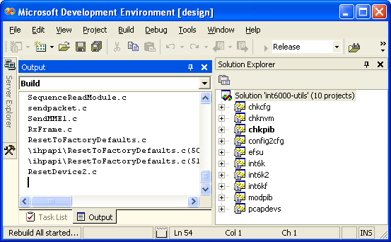

.. _software:

Software
########

.. _software-intro:

Introduction
============

The :program:`Open Powerline Toolkit` is designed to support hardware engineers and embedded software developers working on GNU/Linux and Linux-like systems. Debian GNU/Linux is the platform of choice because it is open source and has extensive cross-platform support. The toolkit has been compiled and executed on several platforms but Qualcomm Atheros does not necessarily support the toolkit on those platforms. Qualcomm Atheros has made every effort to enable cross-platform compatibility by conforming to POSIX standards and following good programming practice but there are limitations on any such effort.

.. _software-security:

Security Considerations
=======================

Toolkit programs are installed in :file:`/usr/local/bin` with owner ``root`` and group ``root`` (:command:`chown root:root`) and with read and execute permissions for owner, group and others (:command:`chmod 0555`). This lets anyone execute these programs even though they are owned by user ``root``.

Additionally,  programs that send raw Ethernet frames are installed with seteuid owner (:command:`chmod 4555`) so that they will execute with ``root`` user privileges, regardless of the user executing them. This lets any user send raw Ethernet frames but it also presents a security risk on the host computer. For example, program :program:`int6k` is intended to read and write :file:`.nvm` and :file:`.pib` files but a malicious user could use it to overwrite other files normally protected by standard file permissions.

You can change the default file permissions by changing the :command:`-m 4555` option on the :command:`install` command in various :file:`Makefiles`. Be aware that doing so will restrict program access to the the ``root`` user.

.. _software-platform-options:

Platform Options
================

Qualcomm Atheros makes no claim that the :program:`Open Powerline Toolkit` will compile  and link in all environments without generating warnings or errors. Different compilers, and compiler versions, treat certain conditions differently and different distributions include different header files or define standard constants and macros differently. Developers should expect to make some source code and makefile modifications to match their environment.

The principle consideration is support for raw Ethernet frames. Other considerations include POSIX compliance,  system header file locations,  compiler version and library support. This section discusses some of these considerations.

.. _platform-linux:

:program:`GNU/Linux`
--------------------

The toolkit will compile and execute on :program:`GNU/Linux` systems without modification by using standard Linux header files and native Linux libraries. Raw socket support is native to the Linux Kernel. This is the preferred environment due to cost, networking speed and ease of access to Layer 2 networking.

Qualcomm Atheros has cross-compiled and executed versions of the toolkit on *MontaVista* and *AMiLDA* Linux both for *MIPSEL* processors. Most toolkit makefiles have symbolic hooks for cross-compilers but Qualcomm Atheros does not support cross-compilation efforts on any platform.

.. _platform-linux-libpcap:

GNU/Linux with Libpcap
----------------------

The toolkit can compile and will execute on :program:`GNU/Linux` systems having the :program:`libpcap` development package and runtime libraries installed; however, this feature is disabled by default because it is not needed on Linux and offers no benefits over native Linux sockets.

.. _platform-linux-bpf:

GNU/Linux with BPF
------------------

The toolkit should compile and execute on :program:`GNU/Linux` systems having :program:`BPF` compiled into the kernel but modifications would be needed to toolkit source code. This configuration has not been tested but the source code is present to support it. Consult Qualcomm Atheros if this option is of interest to you.

.. _platform-osx-bpf:

*Mac OS X* with BPF
-------------------

The toolkit will compile and execute on :program:`Mac OS X` without modification by using native BPF support compiled into the :program:`Darwin` kernel. Compilation is clean on :program:`Leopard` and should be fairly clean on :program:`Tiger`.

You may observe compiler warnings concerning the ``size_t`` data type and ``print`` statements. These warning occur because :program:`Mac OS X` defined the ``size_t`` data type as a 64-bit integer while most other systems define it as a 32-bit integer. Ignore the warnings. We will eventually eliminate them all.

You may observe a compiler warning concerning the definition of intrinsic function ``snprinf``. We are not sure what causes this warning but it will be corrected eventually.

.. _platform-windows-winpcap:

*Windows XP* with WinPcap
-------------------------

The toolkit will compile and execute on Microsoft *Windows XP* having :program:`WinPcap 4.0.1` runtime libraries installed. To assist windows developers, the toolkit includes a Microsoft *Visual Studio .NET 2003* solution file plus required :program:`WinPcap 4.0.1` header files and libraries. The resulting programs should execute on any Microsoft *Windows* computer having :program:`WinPcap 4.0.1` runtime libraries installed. Qualcomm Atheros does not support the toolkit under any Microsoft *Windows* operating system at this time.

Recent versions of the toolkit include self-extracting file :file:`.\\VisualStudioNET\\WinPcap4_0_1.exe` that installs :program:`WinPcap 4.0.1` libraries on your system in cases where you have another version installed. If this creates a conflict the you must resolve it to satisfy your system requirements.

This is not the preferred Toolkit environment due to cost, networking overhead, difficulty accessing Layer network support and lack of a powerful native scripting language. Qualcomm Atheros has not implemented all Toolkit programs on Windows for technical reasons.

.. _software-makefiles:

GNU Makefiles on Linux
======================

The toolkit includes recursive GNU makefiles for Linux. The :file:`Makefile` in the root folder calls Makefiles in subordinate folders. Makefiles in subordinate folders can be run independently to produce individual toolkit components. Developers can control which components are compiled and installed by editing the ``FOLDERS`` symbol in the main Makefile.

Component Makefiles have a standard format that includes the following targets:

compile
    Compiles source code files prior to installation. Intermmediate files and target files are created in the same folder as the Makefile. This is the default target. That means that typing :command:`make` or :command:`make compile` have the same result.

library
    Creates any special folders that are needed for installation. This target is built by the :command:`install` target but it can be built independently.

scripts
    Installs scripts required for proper toolkit operation. This target must be built explicitly to prevent accidental loss of changes made to existing scripts. This target may be built at any time, before or after the :command:`install` target.

manuals
    Creates manuals, documents or html pages. Documentation files are not automatically installed by any target. Installation is left to the user.

install
    Installs executable files in folder :file:`/usr/local/bin`. This target automatically builds the :command:`compile` target before installation. This means that :command:`make install` will compile and install in one step.

uninstall
    Removes installed components. This target does nothing for Makefiles that have :command:`install` targets defined.

clean
    Removes intermmediate and temporary files. Temporary files are defined by variable ``TRASH`` at the start of each Makefile.

fresh
    Removes intermmediate and temporary then re-compiles local targets. It is normally equivalent to :command:`make clean` followed by :command:`make compile`.

Developers wanting to compile the toolkit under *Windows* should use *Visual Studio .NET* solution files instead of makefiles.

Developers wanting to compile the toolkit under :program:`OpenBSD` must make changes to accommodate variations in :program:`make` program syntax.

.. _software-stand-alone:

Stand-alone Compiling on GNU/Linux
==================================

You do not need makefiles to build toolkit programs because source files explicitly include all required components using :command:`include` statement blocks like that shown below. You will see similar blocks near the top of most programs.

The ``MAKEFILE`` constant
-------------------------
.. code-block:: c

    #ifndef MAKEFILE
    #include "../tools/getoptv.c"
    #include "../tools/putoptv.c"
    #include "../tools/version.c"
    ...
    #endif

This mechanism has several advantages. First, the preprocessor ``include`` statements form a complete inventory of required files. Secondly, the relative pathnames help developers locate needed source files. Third,  the complete program can be compiled with one :command:`gcc` command, like the one shown below. This allows program compilation in environments where the :program:`GNU make` program or the Atheros :file:`Makefiles` are not available.

Stand-alone Compiling on GNU/Linux
----------------------------------
.. code-block:: console

    $ gcc -o program program.c

Most toolkit makefiles define the preprocessor constant ``MAKEFILE`` as a compiler option using ``CFLAGS= ... -DMAKEFILE ...``. When this constant is defined, the compiler will not include components inside an include block like that shown above and so the :file:`Makefile` is responsible for compiling and linking all components. If the constant is not defined, because no :file:`Makefile` was used, the compiler will merely include everything needed.

.. _software-cross-compile:

Cross-Compiling on GNU/Linux
============================

Makefiles are setup for cross-compilation using custom toolchains. File :file:`make.def`, in the main toolkit folder, defines cross-comilation symbols referenced in lower-level makefiles. Lower-level makefiles include :file:`make.def` before building their targets. The following is an example :file:`make.def` file used when cross-compiling for the ADM5120 MIPSEL-based gateway.

Cross-compiling with make.def
-----------------------------
.. code-block:: make

	# file: make.def

	# ====================================================================
	# Edimax Hardware;
	# --------------------------------------------------------------------

	PLATFORM=-D_ADM5120_
	MODEL=-D_6104KP_
	ENDIAN=-D_LITTLE_ENDIAN_
	GATEWAY=y

	# ====================================================================
	# AMiLDA Software; uncomment these lines when cross-compiling;
	# --------------------------------------------------------------------

	# CROSS=/export/tools/mipsel-linux-uclibc/bin/mipsel-uclibc-
	# CROSS_LINUX=/export/tools/bin/mipsel-linux-

	# ====================================================================
	# toolchain;
	# --------------------------------------------------------------------

	CC=$(CROSS)gcc
	STRIP=$(CROSS)strip
	LD=$(CROSS)ld
	AR=$(CROSS)ar
	RANLIB=$(CROSS)ranlib
	CAS=$(CROSS)gcc -c
	CPP=$(CROSS)gcc -E

	# ====================================================================
	# folders;
	# --------------------------------------------------------------------

	BIN=/usr/local/bin
	MAN=/usr/share/man/man7
	WWW=/home/www
	DOC=/home/www/software/plc-utils/

	# ====================================================================
	# permissions;
	# --------------------------------------------------------------------

	OWNER=0
	GROUP=0

Developers are encouraged to make changes in this file rather than adding additional variables to the lower-level makefiles. For example, you can edit variable ``BIN`` to install toolkit programs in some location other than :file:`/usr/local/bin` or variable ``WWW`` to install HTML documentation on your local website.

.. _software-visualstudio:

Compilation with Visual Studio .NET 2003
========================================

To build the :program:`Open Powerline Toolkit` on Windows XP, you must have access to a Windows computer with  :program:`Visual Studio .NET 2003` and :program:`WinPcap` runtime libraries installed. :program:`WinPcap` is an open source version of the packet capture library, :program:`libpcap`, widely used on :program:`Linux` and :program:`OpenBSD` systems. It is readily available on the Internet. Installation of these components is beyond the scope of this document.

The Windows and Linux versions of the :program:`Open Powerline Toolkit` use the same code base but the Windows version requires a Microsoft solution file that includes special compiler settings and specific POSIX header files. The solution file and header files are included in the same archive as Linux version.

Microsoft Visual Studio .NET 2003
---------------------------------

Use an application like :program:`WinZip` to extract archived files into a build folder of your choice. Use :program:`Windows Explorer` to locate solution file :file:`.\\VisualStudioNET\\plc-utils.sln` under the toolkit root folder. Double-click the file to open it with :program:`Visual Studio .NET`. In :program:`Visual Studio .NET`, open the ``Solution Explorer`` window and observe a display similar to that shown above.

Figure 1 illustrates a :program:`Visual Studio .NET` window with the ``Solution Explorer`` pane exposed. In the ``Solution Explorer`` window, :command:`right-click` the ``plc-utils`` solution and select the ``Rebuild`` menu option. Compiliation should begin. Watch for comilation errors.

On successful compilation of all projects in this solution, you should find executable programs in the :file:`Release` folder under each project folder. If not then look in the :file:`Debug` folder,  instead. You can now open a console window, change to each :file:`Release` or :file:`Debug` folder in turn and run the programs located there. Instead, we recommend that you create a :program:`Windows Installer` package by :command:`right-clicking` on the ``Install`` project in the ``Solution Explorer`` window and selecting the ``Build`` menu option. Compilation should resume.

On successful completion of the install project build, you should find the :program:`Windows Installer` file :file:`plc-utils.msi` in the :file:`VisualStudioNET` folder above the :program:`install` project folder. Double-clicking on this file will start the :program:`Windows Installer` program.

To distribute the toolkit package to other Windows computers,  copy the :program:`Windows Installer` file to a public network share or some type of portable media.

.. _software-solution-files:

Microsoft Solution Files
========================

The Atheros :program:`Open Powerline Toolkit` includes a *Visual Studio .NET* solution file, :file:`./VisualStudioNET/plc-utils.sln`,  that will build the toolkit on :program:`Windows XP SP2` from the Linux code base. The following information may be helpful to developers wanting to modify or extend the solution or port it to another version of Microsoft :program:`Visual Studio`:

- All projects are WIN32 Console Projects.

- All projects have pre-compiled headers suppressed.

- All projects should globally define preprocessor constant ``MAKEFILE`` to prevent proliferation of "already defined" link errors. See :ref:`Stand-alone Compiling on GNU/Linux <software-stand-alone>` for an explanation of this constant.

- All projects search folder :file:`..\\include` for :gh-src:`stdint.h <VisualStudioNET/include/stdint.h>` and :gh-src:`unistd.h <VisualStudioNET/include/unistd.h>` because Microsoft does not provide them. These header files are customized or abbreviated versions of their POSIX counterparts and should be used when originals are available.

- Projects that perform raw Ethernet I/O should globally define preprocessor constant ``WINPCAP`` to enable appropriate code segments. Preprocessor error statements should (but may not) alert you if ``WINPCAP`` is not defined on *Windows* platforms.

- Projects that perform raw Ethernet I/O search folder :file:`..\\include` for :program:`WinPcap` header files. These files are taken from the :program:`WinPcap` development package and may require periodic updates.  Header files :gh-src:`pcap.h <VisualStudioNET/include/pcap.h>`, :gh-src:`pcap-stdinc.h <VisualStudioNET/include/pcap-stdinc.h>`, :gh-src:`pcap-pbf.h <VisualStudioNET/include/pcap-bpf.h>`, and :gh-src:`bittypes.h <VisualStudioNET/include/bittypes.h>` belong in folder :file:`VisualStudioNET\\include`. Other header files belong in folder :file:`VisualStudioNET\\include\\pcap`.

- Projects that perform raw Ethernet I/O should include folder :file:`..\\library` for core :program:`WinPcap` libraries.

- Projects that perform raw Ethernet I/O should link to libraries :file:`ws2_32.lib`,  :file:`packet.lib` and :file:`wpcap.lib`. The first library is the Microsoft :program:`Winsock2` library. The others are core :program:`WinPcap` libraries.

.. _software-header-files:

Header Files
============

Atheros :program:`Open Powerline Toolkit` programs reference POSIX functions and constants where possible. Specifically, they make wide use of the data types ``uint8_t``, ``uint16_t`` and ``uint32_t`` which are defined in file :file:`stdint.h`. Microsoft *Visual C* and *.NET* environments do not include this file. Consequently, Atheros provides an :gh-src:`alternative stdint.h <VisualStudioNET/include/stdint.h>` in folder :file:`../Windows/include`. This file is open source and was designed to be compatible with the Microsoft development environments; however, you may occassionally experience warnings about the "benign redefinition" for some of these data types.

Where possible, this toolkit includes *OpenBSD* network constants because the OpenBSD project pioneered many of the common network protocols and applications used today. Some systems do not include all *OpenBSD* network header files or do not define all *OpenBSD* network constants. Specifically, Microsoft systems do not provide file :file:`netinet/if_ether.h` and so an :gh-src:`alternative if_ether.h <VisualStudioNET/include/netinet/if_ether.h>` is included in folder :file:`../Windows/include/netinet` and *Windows* applications should include it.

When the :command:`gcc -std=iso9899:1999` option is enabled, some *OpenBSD* header files found on :program:`GNU/Linux` systems will exclude required constant definitions because they do not conform to that standard. Atheros is investigating the best way to address this problem.

On some systems,  such as *OpenBSD*, *FreeBSD* and *Mac OS X*, header files must be included in specific order to avoid compilation errors. We have done our best to deal with this problem. Visit the `GNU Autocnf Project <http://www.gnu.org/software/hello/manual/autoconf/Header-Portability.html>`_ for more information about this.

.. _software-compiler-constants:

Compiler Constants
==================

.. _software-constants-platform:

Platform Constants
------------------

Platform constants conditionaly compile source code blocks based on the hardware architecture and host operating system. Hardware architecture constants are normally defined in system header files. Operating system constants are often compiler intrinsic or defined in system header files.

``__APPLE__``
    A intrinsic compiler constant indicating *Mac OS X* operating system support.

``__BYTE_ORDER``
    A standard constant indicating big or little endian host architecture. Some systems may not define this constant and so an alternative should be used.

``LIBPCAP``
    An Atheros constant, that must be manually defined in your makefile or solution file, to indicate that the target host will have :program:`LibPcap` support. It is not used by the toolkit,  at this time,  and so the associated code has not been tested.

``__linux__``
    A standard constant indicating *GNU/Linux* kernel support. It is automatically defined on *GNU/Linux* systems.

``__OpenBSD__``
    A standard constant indicating *OpenBSD* kernel support. It is automatically define on *OpenBSD* systems. It is not used by the toolkit,  at this time, and so the associated code has not been extensively tested.

``WIN32``
    A standard constant indicating Microsoft *Windows* support. It is automatically defined in Microsoft *Windows* environments.

``WINPCAP``
    An Atheros constant, that must be manually defined in your makefile or solution file, to indicate that the target host will have :program:`WinPcap` support. The toolkit only defines this constant in Windows Microsoft project files for programs that perform raw Ethernet I/O.

.. _software-constants-ethernet:

Ethernet Constants
------------------

The toolkit attempts to use existing definitions for Ethernet related constants where possible. This has been problematic due to inconsistencies in the way different systems structure their header files. Most of the following definitions already exist on *Linux*,  *OpenBSD* and *OS X* but there are still some differences between *Linux* distributions and many constants are undefined on *Windows*.

The *Windows* version of the toolkit includes an abbreviated :file:`net/ethernet.h` that provides constant definitions mentioned in this section.

ETHER_ADDR_LEN
    The length of an Ethernet hardware address in bytes. The value is ``6`` bytes. On *Linux* and *OS X*, this is defined in :file:`net/ethernet.h`.

ETHER_CRC_LEN
    The length of an Ethernet frame FCS trailer. The value is ``4`` bytes. On *Linux* and *OS X*, this is defined in :file:`net/ethernet.h`. Atheros also includes a conditional definition in :file:`int6k/int6k.h` because some *Linux* system do not define it anywhere.

ETHER_HDR_LEN
    The length of an Ethernet frame header including the source address,  destination address and type/length field. The value is ``14`` bytes or ``ETHER_ADDR_LEN`` + ``ETHER_ADDR_LEN`` + ``ETHER_TYPE_LEN``. On *Linux* and *OS X*, this is defined in :file:`net/ethernet.h`.

ETHER_MAX_LEN
    The maximum length of an Ethernet frame in bytes. The value is ``1518`` bytes of ``ETHER_HDR_LEN`` + ``ETHERMTU`` + ``ETHER_CRC_LEN``. On *Linux* and *OS X*,  this is defined in :file:`net/ethernet.h`.

ETHER_MIN_LEN
    The minimum length of an Ethernet frame in bytes. The value is ``64`` bytes. On *Linux* and *OS X* this is defined in :file:`net/ethernet.h`

ETHER_TYPE_LEN
    The length of Ethernet type/length,  or ethertype,  field in bytes. The value is ``2``. On *Linux* and *OS X*, it is defined in :file:`net/ethernet.h`.

ETHERMTU
    The maximum transfer unit (ie; data handling capacity) for an Ethernet frame in bytes. The value is ``1500`` bytes. On *Linux* and *OS X*,  this is defined in :file:`net/ethernet.h`

.. _software-packet-capture:

:program:`LibPcap`,  :program:`WinPcap` and :program:`BPF`
==========================================================

:program:`LibPcap` is an open source Ethernet packet capture library that is widely used. It provides core functionality for the :program:`Wireshark` packet sniffer, formerly known as :program:`Ethereal`. :program:`LibPcap` libraries are available for Linux and OpenBSD. On Linux and OpenBSD you must link applications to  :file:`libpcap.a` and :file:`libwpcap.a`. The toolkit does not use either of these libraries on Linux because they are not needed there.

:program:`WinPcap` is an open source version of :program:`LibPcap` written for Microsoft *Windows*. The :program:`WinPcap` libraries let Windows applications send and receive raw packets. On *Windows* you must link applications to :file:`Packet.lib` and :file:`wpcap.lib`.

In principle, the :program:`LibPcap` and :program:`WinPcap` library implementations should function identically but they do not;  however,  they are similar enough to provide a useful degree of platform independence. Defining preprocessor constants ``LIBPCAP`` or ``WINPCAP`` when compiling the toolkit will enable the corresponding source code. This can be done by adding "-DLIBPCAP" or "-DWINPCAP" to variable ``LFLAGS`` in file :file:`Makefile` in folders int6k, int6k2, efsu and hpav. Constant ``WINPCAP`` need only be defined this way when compiling the toolkit using *cygwin* or *mingw* environments. Do not define both constants ``LIBPCAP`` and ``WINPCAP`` at the same time or compiler errors will occur.

Berkeley Packet Filters (BPF) is an open source Ethernet packet capture mechanism available on many *UNIX*-like systems. Native BPF is supported on some systems but must be explicitly compiled into the kernel on other systems. *Linux* systems normally do not support BPF by default but *Mac OS X* does and so we automatically use it whenever compiler constant ``__APPLE__`` is defined. In principle, one could compile a custom *Linux* kernel with BPF enabled.

.. _software-struct-packing:

Structure Packing
=================

Programs in this toolkit make extensive use of packed data structures to simplify source code and guarantee reliability; however, this creates portability issues because different compilers implement structure packing in different ways. Three common structure packing mechanisms are:

__packed
	The __packed keyword is not part of any C or C++ standard but it is recognized by some compilers, such as the ARM C/C++ and OpenBSD C compiler. This keyword only affects the data structure that it prefaces and it is an ideal way to selectively pack structures. It can be easily defined and undefined using a preprocessor macro. Atheros has elected to insert this keyword wherever it might be appropriate. The ARM C compilers accept this keyword.

	.. code-block:: c

		typedef struct __packed header_eth
		{
			uint8_t source [ETHER_ADDR_LEN];
			uint8_t target [ETHER_ADDR_LEN];
			uint16_t protocol;
		}
		header_eth;

__attribute__ ((packed))
	Attributes are not part of any C or C++ standard but they are recognized by the gcc and Sun Microsystems C compiler. Attributes only affect structures and functions that reference them in their declaration. This is convenient because we can use a preprocessor macro to define the keyword ``__packed``, mentioned above, to be ``__attribute__ ((packed))``. Atheros includes this definition in :file:`tools/types.h` and OpenBSD does this in their system header files.

	.. code-block:: c
		
		typedef struct __attribute__ ((packed)) header_eth
		{
			uint8_t source [ETHER_ADDR_LEN];
			uint8_t target [ETHER_ADDR_LEN];
			uint16_t protocol;
		}
		header_eth;

#pragrma pack
	Pragmas are part of most C and C++ language standards but some compilers do not recognize or implement the ``pack`` pragma. In addition, different compilers implement it in different ways. The ``pack`` pragma affects all data structures up the next ``pack`` pragma or end of compile unit. Most pragma implementations accept the push and pop option for pragma nesting. Some pragma pack implementations accept no arguments, most permit either one or two arguments while others allow three arguments. OpenBSD does not recognize this pragma and generates warnings in all cases. Aside from all that, the pack pragma is the most widely supported method for declaring packed structures.

	.. code-block:: c

		#pragma pack (push, 1)
		struct header_eth
		{
			uint8_t source [ETHER_ADDR_LEN];
			uint8_t target [ETHER_ADDR_LEN];
			uint16_t protocol;
		}
		header_eth;
		#pragma pack (pop)

The Atheros Way
	Toolkit programs declares packed structures using all three methods, as shown below.

	.. code-block:: c
		
		#ifndef __packed
		#ifdef __GNUC__
		#define __packed __attribute__ ((packed))
		#else
		#define __packed
		#endif
		#endif

		#ifndef __GNUC__
		#pragma pack (push, 1)
		#endif

		struct __packed header_eth
		{
			uint8_t source [ETHER_ADDR_LEN];
			uint8_t target [ETHER_ADDR_LEN];
			uint16_t protocol;
		}
		header_eth;

		#ifndef __GNUC__
		#pragma pack (pop)
		#endif

.. _endianess:

Endian-ness
===========

Atheros vendor-specific messages contain information in mixed endian format. The Ethernet header portion is sent *big endian* but the Atheros header and payload are sent in *little endian*. The traditional endian converstion functions ``htons()``, ``htonl()``, ``ntohs()`` and ``ntohl()`` can be used to perform platform independent conversions on the Ethernet header but not the Atheros header payload.

The Open Powerline Toolkit includes similar macros ``HTOLE16``, ``HTOLE32``, ``LE16TOH`` and ``LE32TOH`` in :gh-src:`endian.h <tools/endian.h>` which serve the same function but conform to recommendations for standarized byte order function on Linux, OpenBSD and FreeBSD. Observe that the names are independent of any network implications.

.. code-block:: c

	#if BYTE_ORDER == BIG_ENDIAN
	#	define LE16TOH(x) __bswap_16(x)
	#	define LE32TOH(x) __bswap_32(x)
	#	define LE64TOH(x) __bswap_64(x)
	#	define HTOLE16(x) __bswap_16(x)
	#	define HTOLE32(x) __bswap_32(x)
	#	define HTOLE64(x) __bswap_64(x)
	#elif BYTE_ORDER == LITTLE_ENDIAN
	#	define LE16TOH(x) (x)
	#	define LE32TOH(x) (x)
	#	define LE64TOH(x) (x)
	#	define HTOLE16(x) (x)
	#	define HTOLE32(x) (x)
	#	define HTOLE64(x) (x)
	#else
	#error "Undefined host byte order."
	#endif

.. _packet-basics:

Packet Basics
=============

Local and remote HomePlug AV powerline devices are managed by sending Ethernet frames that contain HomePlug AV formatted management messages. These frames have an 802.3 Ethernet header and a payload that contains the Management Message (MM).

The Ethernet header must be transmitted in newtwork byte order which is big-endian. The Ethernet payload must be sent in *ARM* host byte order which is little endian. You should use standard network functions ``htons()`` and ``htonl()`` to write Ethernet headers and ``ntohs()`` and ``ntohl()`` to read them. You should use function ``HTOLE16()`` and ``HTOLE32()`` to write integer payload values and ``LE26TOH()`` and ``LE32TOH()`` to read them.

::

    +---+---+---+---+---+---+---+---+---+---+---+---+---+---+---+---+ ... +---+---+
    | Ethernet Header                                       | Ethernet Payload    |
    +---+---+---+---+---+---+---+---+---+---+---+---+---+---+---+---+ ... +---+---+

Ethernet headers consist of a destination address (``ODA``), a source address (``OSA``) and an ethertype (``MTYPE``). The ethertype is always 0x88E1 for Homeplug frames of any type. Programmers may use either function :gh-src:`EthernetHeader.c <mme/EthernetHeader.c>` to encode a buffer with the ODA and OSA and the HomePlug ethertype. An example appears later on. Structure ``ethernet_hdr`` is defined in :gh-src:`mme.h <mme/mme.h>` for this purpose.

::

    +---+---+---+---+---+---+---+---+---+---+---+---+---+---+---+---+ ... +---+---+
    |          ODA          |          OSA          | MTYPE | Ethernet Payload    |
    +---+---+---+---+---+---+---+---+---+---+---+---+---+---+---+---+ ... +---+---+

Management messages consist of a message header (MMHEADER) and a message entry (MMENTRY). The message header identifies the nature of the message entry that follows it. The acronyms MME and MMENTRY both mean Management Message Entry but they are often used to mean the entire management message or Ethernet frame. This imprecise usage can be confusing at times. Structure ``homeplug_hdr`` is defined in :gh-src:`mme.h <mme/mme.h>` for this purpose.

::

    +---+ ... +---+---+---+---+---+---+---+---+---+---+---+ ... +---+---+---+---+---+
    |             | MMHEADER              | MMENTRY                                 |
    +---+ ... +---+---+---+---+---+---+---+---+---+---+---+ ... +---+---+---+---+---+

The message header contains message protocol version (MMV), message type (MMTYPE) and vendor identifier (OUI). The management message entry (MMENTRY) that follows the header contains information unique to a the request (REQ), confirmation (CNF), response (RSP) or indication (IND). Programmers may use the Atheros EncodeAtherosHeader function to encode a buffer with a specific MMTYPE and the Atheros MMV and OUI. AN example appears later on.

::

    +---+ ... +---+---+---+---+---+---+---+---+---+---+---+ ... +---+---+---+---+---+
    |             |MMV| MMTYPE|    OUI    |        MMENTRY                          |
    +---+ ... +---+---+---+---+---+---+---+---+---+---+---+ ... +---+---+---+---+---+

The MMV value, within MMHEADER, indicates the Homeplug AV Management Message protocol version which determines how the message should be interpreted. The protocol version is defined in the HomePlug AV Specification and may change from time to time. One notable change is the recent insertion of an FMI (Fragment Management Information ) field between MMTYPE and OUI , as shown below.

In most cases, protocol changes are hidden from the application by the Atheros API functions; however, software developers should set the ``HOMEPLUG_MMV`` constant, defined in :gh-src:`homeplug.h <mme/homeplug.h>`, to the version appropriate for their firmware or application. The value of this constant enables or disables conditional compilation statements throughout the HomePlug API code base.

To send an MME, you must encode an Ethernet frame buffer with information and transmit it. To read an MME, you must read an Ethernet frame buffer and decode it. The information necessary to encode or decode Atheros vendor-specific Ethernet frames is covered in the INT6000 Firmware Technical Reference Manual; however, the Atheros HomePlug API includes many buffer encode and decode functions that support basic operational requirements.

.. _frame-encoding:

Frame Encoding
==============

The following technique illustrates one way to encode a frame buffer with an Ethernet header followed by an Atheros message header. We first declare the frame buffer then a length variable to keep track of how many bytes have actually been encoded. At any time, the value 'buffer + length' is the address of the next buffer position to encode and the expression 'sizeof (buffer) - length' is the number of un-encoded bytes remaining in the buffer. Each call to an encoding function will increment the length for the next operation. This technique minimizes the number of intermmediate application variables and makes maximum use of compiler generated constants.

Frame Encoding by Offset
------------------------

.. code-block:: c

	uint8_t buffer [ETHER_MAX_LEN];
	size_t length = 0;

	uint8_t OSA [ETHER_ADDR_LEN] = { 0x00, 0xB0, 0x52, 0x00, 0xD4, 0x32 };
	uint8_t ODA [ETHER_ADDR_LEN] = { 0x00, 0xB0, 0x52, 0x00, 0x66, 0xF7 };
	uint16_t MMTYPE = 0xA050;

	length += EncodeEthernetHeader (buffer + length, sizeof (buffer) - length, uint8_t OSA, uint8_t ODA);
	length += EncodeAtherosHeader (buffer + length, sizeof (buffer) - length, unit16_t MMTYPE);

	if (length < sizeof (MME))
	{
		error (...);
	}

For those who prefer to use pointers, the following technique accomplishes the same thing because. At any given time, the value bp - buffer is the encoded length.

Frame Encoding by Address
-------------------------
.. code-block:: c

	uint8_t buffer [ETHER_MAX_LEN];
	uint8_t bp = buffer;

	bp += EncodeEthernetHeader (bp, buffer + sizeof (buffer) - bp, uint8_t OSA, uint8_t ODA);
	bp += EncodeAtherosHeader (bp, buffer + sizeof (buffer) - bp, unit16_t MMTYPE);

	if (bp < (buffer + sizeof (MME)))
	{
		error (...);
	}

